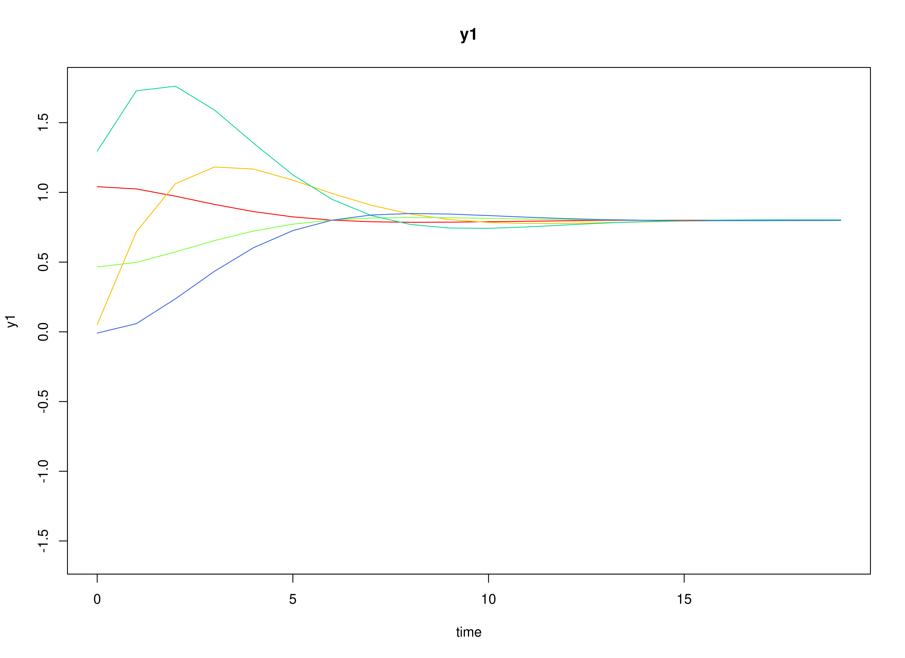
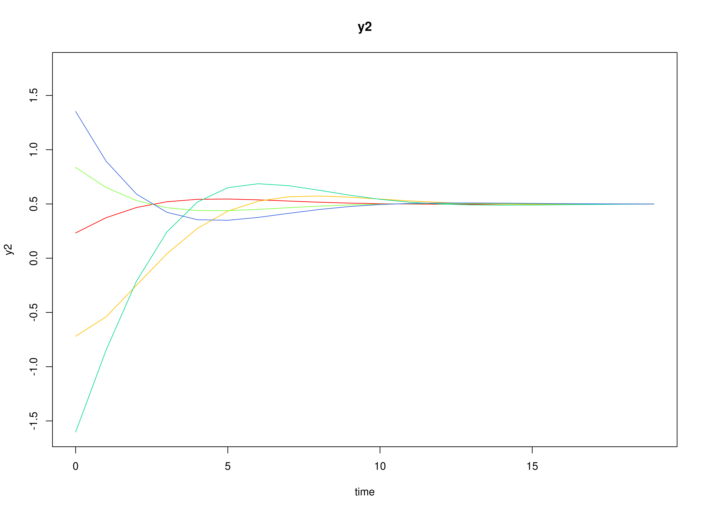

## Dynamics Description

The *Adaptive Recovery* process reflects an asymmetric regulatory dynamic between two latent constructs---such as stress and coping---where activation in one system initiates a corrective response in the other. Specifically, stress tends to increase coping responses, while coping reduces subsequent stress, producing a negative feedback loop that promotes stability and recovery.

Individuals differ in the strength and balance of these cross-regulatory influences, leading to variability in how quickly they return to equilibrium after disturbances. The process noise covariance is moderate and negatively correlated, representing compensatory fluctuations where increases in stress are often accompanied by decreases in coping, while measurement error variance is small and symmetric across variables.

This configuration captures a psychologically meaningful *stress–response* mechanism, characterized by self-correcting dynamics that stabilize the system over time through coordinated but asymmetric influences.

## Model

The measurement model is given by
\begin{equation}
  \mathbf{y}_{i, t}
  =
  \boldsymbol{\nu}_{i}
  +
  \boldsymbol{\Lambda}
  \boldsymbol{\eta}_{i, t}
  +
  \boldsymbol{\varepsilon}_{i, t},
  \quad
  \mathrm{with}
  \quad
  \boldsymbol{\varepsilon}_{i, t}
  \sim
  \mathcal{N}
  \left(
  \mathbf{0},
  \boldsymbol{\Theta}_{i}
  \right)
\end{equation}
where
$\mathbf{y}_{i, t}$,
$\boldsymbol{\eta}_{i, t}$,
and
$\boldsymbol{\varepsilon}_{i, t}$
are random variables
and
$\boldsymbol{\nu}_{i}$,
$\boldsymbol{\Lambda}$,
and
$\boldsymbol{\Theta}_{i}$
are model parameters.
$\mathbf{y}_{i, t}$
represents a vector of observed random variables,
$\boldsymbol{\eta}_{i, t}$
a vector of latent random variables,
and
$\boldsymbol{\varepsilon}_{i, t}$
a vector of random measurement errors,
at time $t$ and individual $i$.
$\boldsymbol{\Lambda}$
denotes a matrix of factor loadings,
and
$\boldsymbol{\Theta}_{i}$
the covariance matrix of
$\boldsymbol{\varepsilon}$
for individual $i$.
In this model,
$\boldsymbol{\Lambda}$ is an identity matrix and
$\boldsymbol{\Theta}_{i}$ is a symmetric matrix.

The dynamic structure is given by
\begin{equation}
  \boldsymbol{\eta}_{i, t}
  =
  \boldsymbol{\beta}_{i}
  \boldsymbol{\eta}_{i, t - 1}
  +
  \boldsymbol{\zeta}_{i, t},
  \quad
  \mathrm{with}
  \quad
  \boldsymbol{\zeta}_{i, t}
  \sim
  \mathcal{N}
  \left(
  \mathbf{0},
  \boldsymbol{\Psi}_{i}
  \right)
\end{equation}
where
$\boldsymbol{\eta}_{i, t}$,
$\boldsymbol{\eta}_{i, t - 1}$,
and
$\boldsymbol{\zeta}_{i, t}$
are random variables,
and
$\boldsymbol{\beta}_{i}$,
and
$\boldsymbol{\Psi}_{i}$
are model parameters.
Here,
$\boldsymbol{\eta}_{i, t}$
is a vector of latent variables
at time $t$ and individual $i$,
$\boldsymbol{\eta}_{i, t - 1}$
represents a vector of latent variables
at time $t - 1$ and individual $i$,
and
$\boldsymbol{\zeta}_{i, t}$
represents a vector of dynamic noise
at time $t$ and individual $i$.
$\boldsymbol{\beta}_{i}$ is
a matrix of autoregression
and cross regression coefficients
for individual $i$,
and
$\boldsymbol{\Psi}_{i}$
the covariance matrix of
$\boldsymbol{\zeta}_{i, t}$
for individual $i$.
In this model,
$\boldsymbol{\Psi}_{i}$ is a symmetric matrix.

## Data Generation

### Notation

Let $t = 10100$ be the number of time points and $n = 100$ be the number of individuals.

Let the measurement model intecept vector $\boldsymbol{\nu}$ be normally distributed with the following means

\begin{equation}
\left(
\begin{array}{c}
  0.8 \\
  0.5 \\
\end{array}
\right)
\end{equation}

and covariance matrix

\begin{equation}
\left(
\begin{array}{cc}
  0.15 & 0.05 \\
  0.05 & 0.1 \\
\end{array}
\right) .
\end{equation}

Let the factor loadings matrix $\boldsymbol{\Lambda}$ be given by

\begin{equation}
\boldsymbol{\Lambda}
=
\left(
\begin{array}{cc}
  1 & 0 \\
  0 & 1 \\
\end{array}
\right) .
\end{equation}

Let the measurement error covariance matrix $\boldsymbol{\Theta}$ be given by

\begin{equation}
\boldsymbol{\Theta}
=
\left(
\begin{array}{cc}
  0.2 & 0.05 \\
  0.05 & 0.2 \\
\end{array}
\right) .
\end{equation}

Let the initial condition
$\boldsymbol{\eta}_{0}$
be given by

\begin{equation}
\boldsymbol{\eta}_{0} \sim \mathcal{N} \left( \boldsymbol{\mu}_{\boldsymbol{\eta} \mid 0}, \boldsymbol{\Sigma}_{\boldsymbol{\eta} \mid 0} \right) .
\end{equation}

$\boldsymbol{\mu}_{\boldsymbol{\eta} \mid 0}$ and $\boldsymbol{\Sigma}_{\boldsymbol{\eta} \mid 0}$ are functions of $\boldsymbol{\alpha}$ and $\boldsymbol{\beta}$.

Let the transition matrix $\boldsymbol{\beta}$ be normally distributed with the following means

\begin{equation}
\left(
\begin{array}{cc}
  0.6 & -0.3 \\
  0.25 & 0.7 \\
\end{array}
\right)
\end{equation}

and covariance matrix

\begin{equation}
\left(
\begin{array}{cccc}
  0.025 & 0.01 & 0 & 0 \\
  0.01 & 0.02 & 0 & 0 \\
  0 & 0 & 0.02 & 0.01 \\
  0 & 0 & 0.01 & 0.025 \\
\end{array}
\right) .
\end{equation}

Let the intercept vector $\boldsymbol{\alpha}$ be fixed to a zero vector. 

The `SimNuN` and `SimBetaN` functions from the `simStateSpace` package generates random intercept vectors and transition matrices from the multivariate normal distribution. Note that the `SimBetaN` function generates transition matrices that are weakly stationary with an option to set lower and upper bounds.

Let the dynamic process noise $\boldsymbol{\Psi}$ be given by

\begin{equation}
\boldsymbol{\Psi}
=
\left(
\begin{array}{cc}
  0.25 & -0.1 \\
  -0.1 & 0.22 \\
\end{array}
\right) .
\end{equation}


### R Function Arguments


``` r
n
#> [1] 100
time
#> [1] 10100
burnin
#> [1] 10000
# first mu0 in the list of length n
mu0[[1]]
#> [1] 0 0
# first sigma0 in the list of length n
sigma0[[1]]
#>            [,1]       [,2]
#> [1,]  0.3399277 -0.0557114
#> [2,] -0.0557114  1.1620385
# first sigma0_l in the list of length n
sigma0_l[[1]] # sigma0_l <- t(chol(sigma0))
#>             [,1]     [,2]
#> [1,]  0.58303323 0.000000
#> [2,] -0.09555442 1.073735
alpha
#> [[1]]
#> [1] 0 0
# first beta in the list of length n
beta[[1]]
#>           [,1]       [,2]
#> [1,] 0.5159622 0.01359474
#> [2,] 0.3202660 0.89904484
# first psi in the list of length n
psi[[1]]
#>       [,1]  [,2]
#> [1,]  0.25 -0.10
#> [2,] -0.10  0.22
psi_l[[1]] # psi_l <- t(chol(psi))
#>      [,1]      [,2]
#> [1,]  0.5 0.0000000
#> [2,] -0.2 0.4242641
# first nu in the list of length n
nu[[1]]
#> [1] 0.9586888 0.3159734
lambda
#> [[1]]
#>      [,1] [,2]
#> [1,]    1    0
#> [2,]    0    1
# first theta in the list of length n
theta[[1]]
#>      [,1] [,2]
#> [1,] 0.20 0.05
#> [2,] 0.05 0.20
theta_l[[1]] # theta_l <- t(chol(theta))
#>           [,1]      [,2]
#> [1,] 0.4472136 0.0000000
#> [2,] 0.1118034 0.4330127
```

### Visualizing the Dynamics Without Process Noise and Measurement Error (n = 5 with Different Initial Condition)



### Using the `SimSSMIVary` Function from the `simStateSpace` Package to Simulate Data


``` r
library(simStateSpace)
sim <- SimSSMIVary(
  n = n,
  time = time,
  mu0 = mu0,
  sigma0_l = sigma0_l,
  alpha = alpha,
  beta = beta,
  psi_l = psi_l,
  nu = nu,
  lambda = lambda,
  theta_l = theta_l
)
data <- as.data.frame(sim, burnin = burnin)
head(data)
#>   id time         y1        y2
#> 1  1    0  0.8291753 3.2710934
#> 2  1    1  0.6746055 1.3890488
#> 3  1    2 -0.1382709 2.3329283
#> 4  1    3  0.8305492 1.3526075
#> 5  1    4  0.5140580 0.9390967
#> 6  1    5  1.7236689 0.8050827
plot(sim, burnin = burnin)
```


## Model Fitting


``` r
library(fitDTVARMxID)
```

The `FitDTVARMxID` function fits a DT-VAR model on each individual $i$.
To set up the estimation, we first provide **starting values** for each parameter matrix.

### Autoregressive Parameters (`beta`)

The autoregressive coefficient matrix $\boldsymbol{\beta}$ is given starting values.


``` r
beta_values <- beta
```

### Intercepts (`nu`)

The intercept vector $\boldsymbol{\nu}$ is initialized with starting values.


``` r
nu_values <- nu
```

### LDL′-parameterized covariance matrices

Covariances such as `psi` and `theta` are estimated using the LDL′ decomposition of a positive definite covariance matrix. The decomposition expresses a covariance matrix $\Sigma$ as  

\begin{equation}
  \boldsymbol{\Sigma} = \left( \mathbf{L} + \mathbf{I} \right) \mathrm{diag} \left( \mathrm{Softplus} \left( \mathbf{d}_{uc} \right) \right) \left( \mathbf{L} + \mathbf{I} \right)^{\prime},
\end{equation}

where:

- $\mathbf{L}$ is a strictly lower-triangular matrix of free parameters (`l_mat_strict`),  
- $\mathbf{I}$ is the identity matrix,  
- $\mathbf{d}_{uc}$ is an unconstrained vector,  
- $\mathrm{Softplus} \left(\mathbf{d}_{uc} \right) = \log \left(1 + \exp \left( \mathbf{d}_{uc} \right) \right)$ ensures strictly positive diagonal entries.  

The `LDL()` function extracts this decomposition from a positive definite covariance matrix. It returns:  

- `d_uc`: unconstrained diagonal parameters, equal to `InvSoftplus(d_vec)`,  
- `d_vec`: diagonal entries, equal to `Softplus(d_uc)`,  
- `l_mat_strict`: the strictly lower-triangular factor.  


``` r
sigma <- matrix(
  data = c(1.0, 0.5, 0.5, 1.0),
  nrow = 2,
  ncol = 2
)

ldl_sigma <- LDL(sigma)
d_uc <- ldl_sigma$d_uc
l_mat_strict <- ldl_sigma$l_mat_strict
I <- diag(2)
sigma_reconstructed <- (l_mat_strict + I) %*% diag(log1p(exp(d_uc)), 2) %*% t(l_mat_strict + I)
sigma_reconstructed
#>      [,1] [,2]
#> [1,]  1.0  0.5
#> [2,]  0.5  1.0
```

#### Process Noise Covariance Matrix (`psi`)

Starting values for the process noise covariance matrix $\boldsymbol{\Psi}$ are given below, with corresponding LDL′ parameters.


``` r
psi_values <- psi[[1]]
ldl_psi_values <- LDL(psi_values)
psi_d_values <- ldl_psi_values$d_uc
psi_l_values <- ldl_psi_values$l_mat_strict
```


``` r
psi_d_values
#> [1] -1.258692 -1.623449
```


``` r
psi_l_values
#>      [,1] [,2]
#> [1,]  0.0    0
#> [2,] -0.4    0
```

#### Measurement Error Covariance Matrix (`theta`)

Starting values for the measurement error covariance matrix $\boldsymbol{\Theta}$ are given below, with corresponding LDL′ parameters.


``` r
theta_values <- theta[[1]]
ldl_theta_values <- LDL(theta_values)
theta_d_values <- ldl_theta_values$d_uc
```


``` r
theta_d_values
#> [1] -1.507772 -1.578762
```


``` r
theta_l_values <- ldl_theta_values$l_mat_strict
```

### Initial mean vector (`mu_0`) and covariance matrix (`sigma_0`)

The initial mean vector $\boldsymbol{\mu_0}$ and covariance matrix $\boldsymbol{\Sigma_0}$
are fixed using `mu0` and `sigma0`.


``` r
mu0_values <- mu0
```


``` r
sigma0_values <- lapply(
  X = sigma0,
  FUN = LDL
)
sigma0_d_values <- lapply(
  X = sigma0_values,
  FUN = function(i) {
    i$d_uc
  }
)
sigma0_l_values <- lapply(
  X = sigma0_values,
  FUN = function(i) {
    i$l_mat_strict
  }
)
```

### `FitDTVARMxID`


``` r
fit <- FitDTVARMxID(
  data = data,
  observed = c("y1", "y2"),
  id = "id",
  beta_values = beta_values,
  psi_d_values = psi_d_values,
  psi_l_values = psi_l_values,
  nu_values = nu_values,
  theta_diag = FALSE,
  theta_d_values = theta_d_values,
  theta_l_values = theta_l_values,
  mu0_values = mu0_values,
  sigma0_d_values = sigma0_d_values,
  sigma0_l_values = sigma0_l_values,
  prefix = "recovery",
  quiet = TRUE,
  ncores = parallel::detectCores()
)
#> Warning in parallel::mclapply(X = model, FUN = .MxHelperReadRunSave,
#> tries_explore = tries_explore, : scheduled cores 11, 15, 9, 19, 1, 7, 21, 23
#> encountered errors in user code, all values of the jobs will be affected
```

#### Parameter estimates


``` r
summary(fit)
#>                             beta_1_1      beta_2_1     beta_1_2    beta_2_2
#> recovery_DTVAR_ID1.Rds    0.39044027  1.3692027671 -0.058268493  0.98794098
#> recovery_DTVAR_ID2.Rds    0.90043721  0.2766190295 -0.021488979  0.92513853
#> recovery_DTVAR_ID3.Rds    0.59239657  0.3867981612 -0.333751623  0.61144181
#> recovery_DTVAR_ID4.Rds    0.56499626  0.2857954079 -0.502772611  1.00835828
#> recovery_DTVAR_ID5.Rds    0.50878046  0.5756687018 -0.240864464  1.01177319
#> recovery_DTVAR_ID6.Rds    0.58200920  0.4036279441 -0.294975992  0.90588689
#> recovery_DTVAR_ID8.Rds    0.45435105  0.2447150092 -0.369779845  1.07396799
#> recovery_DTVAR_ID10.Rds   0.06178365  0.1193063652 -0.654484910  0.95556869
#> recovery_DTVAR_ID11.Rds   0.57367058  0.1766850642 -0.840708179  0.55550562
#> recovery_DTVAR_ID12.Rds   0.99423880  0.3450523394 -0.275803415  0.63272979
#> recovery_DTVAR_ID13.Rds   0.64166266  0.5439697934 -0.267555715  0.48579023
#> recovery_DTVAR_ID15.Rds   0.68697920  0.0987509142 -0.415917137  0.47127791
#> recovery_DTVAR_ID16.Rds   0.13160110  0.1001369364 -0.141215568  0.72866104
#> recovery_DTVAR_ID17.Rds   0.52395885 -0.0403998952 -0.438215124  0.22310265
#> recovery_DTVAR_ID18.Rds   0.53433122  0.3112677312 -0.575898602  0.54066940
#> recovery_DTVAR_ID20.Rds   0.74401044 -0.0032939782 -0.101065843  0.66038348
#> recovery_DTVAR_ID21.Rds   0.56518561  0.2598449786 -0.139775297  0.76110689
#> recovery_DTVAR_ID22.Rds   0.61951456  0.2572922728 -1.058772570  0.45212391
#> recovery_DTVAR_ID24.Rds   0.90790334  0.5631207364 -0.075053737  0.80700863
#> recovery_DTVAR_ID25.Rds   0.64882142  0.2160567019 -0.416787191  0.84931193
#> recovery_DTVAR_ID26.Rds   0.73457655  0.4691430718 -0.392783333  0.94723326
#> recovery_DTVAR_ID27.Rds   0.84341347  0.4556903726 -0.354158813  0.40312022
#> recovery_DTVAR_ID29.Rds   0.75388942  0.4629289533 -0.500346632  0.79036173
#> recovery_DTVAR_ID30.Rds   0.69173150  0.2576436284 -0.790464539  0.73888508
#> recovery_DTVAR_ID31.Rds   0.35090498  0.3566728828 -0.758954637  0.83522279
#> recovery_DTVAR_ID32.Rds   0.66870687  0.3912374374 -0.006082079  0.75631883
#> recovery_DTVAR_ID34.Rds   0.75079512  0.3338429687 -0.171445738  0.72510173
#> recovery_DTVAR_ID35.Rds   0.51995222  0.0001639473 -0.160326268  0.90621224
#> recovery_DTVAR_ID36.Rds   0.53855156 -0.0583865657 -0.336898586  0.25251010
#> recovery_DTVAR_ID37.Rds   0.76882708  0.0909800492  0.036334915  0.91364611
#> recovery_DTVAR_ID38.Rds   0.82964095  0.2998673067 -0.257364858  0.90546870
#> recovery_DTVAR_ID40.Rds   0.76030273  0.1159904467 -0.448574700  0.78829069
#> recovery_DTVAR_ID41.Rds   0.75640067  0.0752866319 -0.262963291  0.97489251
#> recovery_DTVAR_ID42.Rds   0.36565141  0.2391027476 -0.738555602  1.05070873
#> recovery_DTVAR_ID43.Rds   0.16140131  0.5012525043 -0.605990159  0.68402128
#> recovery_DTVAR_ID44.Rds   0.60306093 -0.0631592256 -0.286207053  0.23368990
#> recovery_DTVAR_ID46.Rds   0.56933298  0.1119520598 -0.468404487  0.83310561
#> recovery_DTVAR_ID47.Rds   0.49061215  0.1811881307 -0.655528029  0.87617166
#> recovery_DTVAR_ID49.Rds   0.62921529  0.0932056162 -0.432805859  0.81220694
#> recovery_DTVAR_ID51.Rds   0.83574990  0.2861970643 -1.114714401  0.15758098
#> recovery_DTVAR_ID52.Rds   0.54240262 -0.0489186484 -0.197493367  0.55045443
#> recovery_DTVAR_ID53.Rds   0.44672212  0.2165110960 -0.515799246  0.63181212
#> recovery_DTVAR_ID54.Rds   0.17688055  0.4670037492 -0.583640096  1.23407952
#> recovery_DTVAR_ID56.Rds   0.44502158  0.4499536989 -0.461918458 -0.07010878
#> recovery_DTVAR_ID60.Rds   0.39508608  0.4406755640 -0.624008466  1.29344884
#> recovery_DTVAR_ID61.Rds   0.53342721  0.2193837532 -0.374938465  0.80871692
#> recovery_DTVAR_ID62.Rds   0.45538328  0.1580153233 -0.034186377  0.49235491
#> recovery_DTVAR_ID65.Rds   0.68627526  0.3120043251 -0.486229535  0.98761377
#> recovery_DTVAR_ID66.Rds   0.86864403  0.4301419068 -0.203659696  0.66058285
#> recovery_DTVAR_ID67.Rds   0.90576544  0.5198722107 -0.250276246  0.72943020
#> recovery_DTVAR_ID68.Rds   0.31938244 -0.1231477095 -0.774158959  0.56492426
#> recovery_DTVAR_ID69.Rds   0.71134336  0.2847897110 -0.379363878  0.83521627
#> recovery_DTVAR_ID70.Rds   1.18119173  0.3588179167 -0.634398535  0.37874869
#> recovery_DTVAR_ID71.Rds   0.42868061  0.3587326708 -0.298277134  0.83126511
#> recovery_DTVAR_ID72.Rds   0.75726377  0.1563358043 -0.031975742  0.87356775
#> recovery_DTVAR_ID73.Rds   0.76482478  0.2311347841 -0.373050214  0.88508053
#> recovery_DTVAR_ID74.Rds   1.03359941  0.2115877903 -0.583534868  0.60710051
#> recovery_DTVAR_ID75.Rds   0.53917698  0.0672195819 -0.870198396  0.42310588
#> recovery_DTVAR_ID76.Rds  -0.01085642  0.3610887628 -1.475731743  1.38537620
#> recovery_DTVAR_ID77.Rds   0.49433855  0.1830254930 -1.031541077  0.74977522
#> recovery_DTVAR_ID78.Rds   0.35847456  0.2035820868 -0.307873926  0.37074089
#> recovery_DTVAR_ID80.Rds   0.52231895  0.2603989532 -0.231953646  0.79281424
#> recovery_DTVAR_ID81.Rds   0.51897399  0.3824844763 -0.530441188  0.54363600
#> recovery_DTVAR_ID84.Rds   0.60682994  0.0335956749 -0.462498080  0.45339329
#> recovery_DTVAR_ID85.Rds   0.36599995  0.1344016321 -0.346177599  0.87779610
#> recovery_DTVAR_ID86.Rds   0.45064531 -0.0639493517 -0.173240332  0.79865911
#> recovery_DTVAR_ID87.Rds   0.52469831  0.4389967209 -0.276824979  0.71164341
#> recovery_DTVAR_ID88.Rds   0.64189878  0.3128963673 -0.222983413  0.84264528
#> recovery_DTVAR_ID89.Rds   0.22953801  0.3447867057 -0.428674787  0.81001999
#> recovery_DTVAR_ID90.Rds   0.57125481  0.1241742483 -0.275225066  0.82043144
#> recovery_DTVAR_ID91.Rds   0.51507679  0.3332087586 -0.259613662  0.92067096
#> recovery_DTVAR_ID92.Rds   0.63167425  0.2915555042 -0.277366214  0.73083807
#> recovery_DTVAR_ID93.Rds   0.64640184  0.2355941228 -0.540281035  0.31093885
#> recovery_DTVAR_ID94.Rds   0.73064449  0.0501555229 -0.029190627  0.50119911
#> recovery_DTVAR_ID95.Rds   0.31274447 -0.1339327007 -0.163296812  0.80318291
#> recovery_DTVAR_ID96.Rds   0.64140427 -0.2687498306 -0.366245586  0.44939428
#> recovery_DTVAR_ID97.Rds   0.84662202  0.4759162173 -0.260279265  0.42828244
#> recovery_DTVAR_ID98.Rds   0.44795404  0.2258438362 -0.240487957  0.41298355
#> recovery_DTVAR_ID99.Rds   0.53118015  0.0351907362 -0.173887375  0.82586377
#> recovery_DTVAR_ID100.Rds  0.76787490  0.1538084768 -0.663975835  0.50434613
#>                               nu_1_1       nu_2_1    psi_l_2_1  psi_d_1_1
#> recovery_DTVAR_ID1.Rds    0.98214401  0.131762987 -1.162873340 -2.2633862
#> recovery_DTVAR_ID2.Rds    1.01114787  0.524425878 -2.582248256 -3.1155170
#> recovery_DTVAR_ID3.Rds    0.95417705  0.567269560 -0.046315496 -1.4242712
#> recovery_DTVAR_ID4.Rds    0.97107212  0.390580642 -0.495868708 -1.5177252
#> recovery_DTVAR_ID5.Rds    0.15604450  0.243348131 -0.851116734 -1.6057745
#> recovery_DTVAR_ID6.Rds    1.08278039  0.384392210 -0.286660891 -1.1566110
#> recovery_DTVAR_ID8.Rds    0.81604953  0.364630271 -0.100640651 -2.1965813
#> recovery_DTVAR_ID10.Rds   1.56384584  0.956150154  0.105810501 -0.9083264
#> recovery_DTVAR_ID11.Rds   0.76698757  0.670736629 -0.418388935 -1.7368868
#> recovery_DTVAR_ID12.Rds   1.18863115  0.941421074 -0.727258883 -1.9880514
#> recovery_DTVAR_ID13.Rds   0.09441754  0.218403181 -0.886435278 -2.5645395
#> recovery_DTVAR_ID15.Rds   0.58935241  0.597071221 -0.248661925 -2.0555203
#> recovery_DTVAR_ID16.Rds   1.26565228  0.897775015 -0.220307111 -0.8189365
#> recovery_DTVAR_ID17.Rds   0.97330266  0.004582576 -0.234041818 -0.9076080
#> recovery_DTVAR_ID18.Rds   0.53886747  0.435105424 -0.400006668 -1.0387779
#> recovery_DTVAR_ID20.Rds   1.10235157  0.479193851 -1.027760336 -3.0718233
#> recovery_DTVAR_ID21.Rds   1.61797754 -0.067847839 -0.379080930 -0.6056950
#> recovery_DTVAR_ID22.Rds   0.92170961  0.407806185 -0.093728010 -1.7338854
#> recovery_DTVAR_ID24.Rds  -0.17208043  1.074679215 -1.944342289 -3.9940431
#> recovery_DTVAR_ID25.Rds   1.19179018  0.468162788 -0.126911236 -1.5129883
#> recovery_DTVAR_ID26.Rds   0.81623373  0.455974907 -0.284557448 -0.9747522
#> recovery_DTVAR_ID27.Rds   1.06841141 -0.054754500 -0.848458059 -1.9254988
#> recovery_DTVAR_ID29.Rds   0.51212097  0.534547100 -2.113526236 -2.9473738
#> recovery_DTVAR_ID30.Rds   0.31557718  0.575806486 -0.358025043 -1.4887687
#> recovery_DTVAR_ID31.Rds  -0.01353243  0.161847082 -0.437270595 -1.1792374
#> recovery_DTVAR_ID32.Rds   1.70768102  0.572852797 -0.795155974 -1.3900951
#> recovery_DTVAR_ID34.Rds   0.40670559  0.232937375 -0.270509546 -1.1559717
#> recovery_DTVAR_ID35.Rds   1.16657878  1.134246331 -0.110687248 -1.6595316
#> recovery_DTVAR_ID36.Rds   0.39334216  0.529078457 -0.153386155 -0.7626769
#> recovery_DTVAR_ID37.Rds   1.24174691  0.628873531 -0.793004665 -1.9172463
#> recovery_DTVAR_ID38.Rds   0.55979135  0.418986405 -0.415018761 -1.0698764
#> recovery_DTVAR_ID40.Rds   1.08469877  0.958219442  1.956477101 -3.7662757
#> recovery_DTVAR_ID41.Rds   0.97666555 -0.347336491 -0.226781134 -0.5854522
#> recovery_DTVAR_ID42.Rds   0.92621718  0.857721771  2.857467178 -4.5145470
#> recovery_DTVAR_ID43.Rds   1.50099105  0.127025510 -0.128734364 -0.7932191
#> recovery_DTVAR_ID44.Rds   0.95922318  0.489397489  0.279304599 -1.2015317
#> recovery_DTVAR_ID46.Rds   0.91629721  0.553315221 -0.090692008 -1.1408518
#> recovery_DTVAR_ID47.Rds   0.76511227  0.621206168 -0.555081655 -1.7485504
#> recovery_DTVAR_ID49.Rds   1.27831441  0.077359070  0.040627931 -1.8049184
#> recovery_DTVAR_ID51.Rds   0.57991141  0.933640229 -1.047643661 -3.0602958
#> recovery_DTVAR_ID52.Rds   0.72350994  0.288862051 -0.274636093 -0.8146574
#> recovery_DTVAR_ID53.Rds   0.53424864  0.326200325 -0.511240898 -1.1840285
#> recovery_DTVAR_ID54.Rds   0.21238404  0.230947502 -0.421677006 -0.8433089
#> recovery_DTVAR_ID56.Rds   0.44201958  0.716828930  0.203124579 -0.9436117
#> recovery_DTVAR_ID60.Rds   1.10491571  0.565296477 -0.468232991 -1.5515378
#> recovery_DTVAR_ID61.Rds   1.11391824  0.355867016 -0.475357636 -1.0896954
#> recovery_DTVAR_ID62.Rds   1.46642684  0.665172155  0.738291281 -1.4659479
#> recovery_DTVAR_ID65.Rds   0.48797534  0.175973926 -0.837925642 -0.9704910
#> recovery_DTVAR_ID66.Rds   0.21816784  0.458069439 -1.026893584 -1.6997338
#> recovery_DTVAR_ID67.Rds   0.59935028  1.019054260 -0.672740505 -1.4210082
#> recovery_DTVAR_ID68.Rds   0.98405556  0.881642411  0.303139175 -0.9452365
#> recovery_DTVAR_ID69.Rds   0.51235152 -0.242584885 -0.234265665 -1.8429430
#> recovery_DTVAR_ID70.Rds   0.52820216  0.332654680 -5.049205414 -5.2327969
#> recovery_DTVAR_ID71.Rds   0.38020073  0.413200826  0.047166601 -1.0624973
#> recovery_DTVAR_ID72.Rds   0.55059296  0.367358987 -0.358642576 -0.8686240
#> recovery_DTVAR_ID73.Rds   0.57027174  0.505610404 -1.323702895 -2.5158317
#> recovery_DTVAR_ID74.Rds   0.29666744 -0.026142878 -4.764564343 -5.3983010
#> recovery_DTVAR_ID75.Rds   0.54333153  0.915017688  0.323167414 -1.0138527
#> recovery_DTVAR_ID76.Rds   0.66755107  0.731804553 -0.305670305 -0.5754081
#> recovery_DTVAR_ID77.Rds   0.38284995  0.493065322 -0.750883083 -2.1366172
#> recovery_DTVAR_ID78.Rds   0.25538181  0.653933282 -0.532964530 -0.7995357
#> recovery_DTVAR_ID80.Rds   0.90152100  0.623200370 -1.346210378 -2.1247326
#> recovery_DTVAR_ID81.Rds   0.84301526  0.771429032 -0.588656844 -1.7085839
#> recovery_DTVAR_ID84.Rds   0.66820374  0.195224650  0.002471167 -1.0876868
#> recovery_DTVAR_ID85.Rds   0.52785866  0.209341190 -0.206894849 -0.7686162
#> recovery_DTVAR_ID86.Rds   1.31165867 -1.002934979 -0.530826945 -1.1682158
#> recovery_DTVAR_ID87.Rds   0.74545206  0.187394169 -0.670339878 -1.6205579
#> recovery_DTVAR_ID88.Rds   1.08976242  0.686908874 -0.092179679 -0.5694083
#> recovery_DTVAR_ID89.Rds   0.98458010  0.306075981 -0.248584891 -0.6758135
#> recovery_DTVAR_ID90.Rds  -0.19668123  0.634745384  0.081925651 -1.3108288
#> recovery_DTVAR_ID91.Rds   0.95636336 -0.004532275 -0.281513057 -1.4564530
#> recovery_DTVAR_ID92.Rds   0.62779064 -0.115863241 -0.652303382 -2.6016246
#> recovery_DTVAR_ID93.Rds   1.08444979  1.167182092 -0.340961209 -1.2129701
#> recovery_DTVAR_ID94.Rds   0.78823573  0.405190691 -0.968532647 -1.2411359
#> recovery_DTVAR_ID95.Rds   1.10570064 -0.197745237  0.102178164 -0.7835402
#> recovery_DTVAR_ID96.Rds   0.50232380  0.672156309  0.465104307 -1.1958547
#> recovery_DTVAR_ID97.Rds   0.61507636  0.277892432 -0.505511267 -1.9121361
#> recovery_DTVAR_ID98.Rds   1.13060211  0.581008109  0.119746620 -0.7775243
#> recovery_DTVAR_ID99.Rds   1.29074957  0.129438186 -0.370939158 -0.7174453
#> recovery_DTVAR_ID100.Rds  0.68889834  0.113436368  0.332352603 -1.1790595
#>                            psi_d_2_1  theta_l_2_1 theta_d_1_1 theta_d_2_1
#> recovery_DTVAR_ID1.Rds   -22.8407531  0.289895191  -1.2586232  -2.2665574
#> recovery_DTVAR_ID2.Rds   -24.2570014  0.236191510  -0.5004152  -2.2926052
#> recovery_DTVAR_ID3.Rds    -1.2836965 -0.066355142  -1.4283195  -1.7522430
#> recovery_DTVAR_ID4.Rds    -1.3707552  0.307093443  -1.6907449  -1.5113031
#> recovery_DTVAR_ID5.Rds    -2.4194185  0.565907510  -1.3047281  -1.8713917
#> recovery_DTVAR_ID6.Rds    -2.0433156  0.249221702  -1.0095046  -1.0166934
#> recovery_DTVAR_ID8.Rds    -2.9953458  0.117736598  -0.9480687  -1.3776293
#> recovery_DTVAR_ID10.Rds   -1.8459687 -7.061492603  -5.4772360 -20.1503872
#> recovery_DTVAR_ID11.Rds   -2.0087541  0.277229968  -1.6297050  -1.8259279
#> recovery_DTVAR_ID12.Rds   -1.1026413 -0.138079503  -1.0426291  -2.0338441
#> recovery_DTVAR_ID13.Rds   -1.1514450  0.065510307  -0.9138007  -1.6930246
#> recovery_DTVAR_ID15.Rds   -1.3490109  0.137329381  -1.3509346  -1.2937467
#> recovery_DTVAR_ID16.Rds   -1.3286699  2.814591300  -3.8927198 -17.6182825
#> recovery_DTVAR_ID17.Rds   -1.1715578 -1.544082752  -3.5881015 -17.9877558
#> recovery_DTVAR_ID18.Rds   -1.6659440  0.293836924  -1.5055222  -1.9633341
#> recovery_DTVAR_ID20.Rds   -1.4151721  0.051559574  -0.8502092  -1.7628286
#> recovery_DTVAR_ID21.Rds   -0.8172064  1.265976686  -2.5742041 -20.4230044
#> recovery_DTVAR_ID22.Rds   -2.0696156 -0.230760852  -2.3443175  -1.1997210
#> recovery_DTVAR_ID24.Rds  -21.5942091 -0.145377446  -0.8200225  -1.0648912
#> recovery_DTVAR_ID25.Rds   -1.4511114 -0.033007922  -1.1715843  -2.3462094
#> recovery_DTVAR_ID26.Rds   -1.9870352  0.080711873  -1.9671024  -1.7562993
#> recovery_DTVAR_ID27.Rds   -1.9786325  0.185737428  -1.2249945  -1.6798306
#> recovery_DTVAR_ID29.Rds  -21.3277744 -0.005258836  -1.0483753  -1.6584809
#> recovery_DTVAR_ID30.Rds   -3.1884430  0.068768197  -1.1000010  -0.7077002
#> recovery_DTVAR_ID31.Rds   -4.0022810  0.370909249  -1.7058054  -1.1612704
#> recovery_DTVAR_ID32.Rds   -1.6802488  0.402426348  -1.7614479  -3.6089236
#> recovery_DTVAR_ID34.Rds   -0.9502505  0.082734578  -1.8942461  -2.6570167
#> recovery_DTVAR_ID35.Rds   -1.7224942  0.371997090  -1.4699194  -2.1813078
#> recovery_DTVAR_ID36.Rds   -0.7917807  0.005656379  -3.8751728 -23.0180763
#> recovery_DTVAR_ID37.Rds   -2.6282731  0.300653846  -1.3890402  -1.4776975
#> recovery_DTVAR_ID38.Rds   -3.4934037  0.575955528  -1.6443616  -1.0083803
#> recovery_DTVAR_ID40.Rds   -2.3330827 -0.213298898  -0.8677978  -1.8447609
#> recovery_DTVAR_ID41.Rds   -2.4346284  0.121207984  -2.3938489  -1.3661627
#> recovery_DTVAR_ID42.Rds  -17.5777370 -0.076108437  -0.9124657  -0.8494337
#> recovery_DTVAR_ID43.Rds   -1.6248239  0.719650323  -2.0130107  -1.6278414
#> recovery_DTVAR_ID44.Rds   -1.0453752 -0.503583220  -1.3331524 -19.5491351
#> recovery_DTVAR_ID46.Rds   -2.4720165  0.309873604  -2.4982570  -0.8349150
#> recovery_DTVAR_ID47.Rds   -2.7420289  0.331613122  -1.0745906  -1.4859461
#> recovery_DTVAR_ID49.Rds   -1.9318647 -0.086656701  -1.4771487  -1.8033965
#> recovery_DTVAR_ID51.Rds   -3.1337562 -0.031121420  -1.4132211  -1.1472973
#> recovery_DTVAR_ID52.Rds   -1.4264364 -0.033217285  -1.3149564  -1.7175889
#> recovery_DTVAR_ID53.Rds   -2.9039802  0.374462019  -2.0745400  -1.2095740
#> recovery_DTVAR_ID54.Rds   -3.7203598  1.981150969  -2.7431099  -2.9558594
#> recovery_DTVAR_ID56.Rds   -1.4230609 -1.742085802  -3.1347508 -18.7532758
#> recovery_DTVAR_ID60.Rds   -4.1472023  0.748612720  -1.6967359  -2.0396023
#> recovery_DTVAR_ID61.Rds   -1.0408405  0.442945446  -1.5680851  -2.7097844
#> recovery_DTVAR_ID62.Rds   -1.6799974 -0.653298441  -1.3355914 -20.2093798
#> recovery_DTVAR_ID65.Rds   -2.0833367  0.383498445  -1.5345258  -1.7151533
#> recovery_DTVAR_ID66.Rds   -1.1253460  0.398017427  -1.5346854 -21.2477871
#> recovery_DTVAR_ID67.Rds   -0.5125424 -0.006953368  -1.1964124  -2.8085745
#> recovery_DTVAR_ID68.Rds   -1.6061565 -4.614459468  -4.6261154 -16.4776677
#> recovery_DTVAR_ID69.Rds   -2.7294898  0.107600515  -1.1332257  -1.4916166
#> recovery_DTVAR_ID70.Rds  -17.5284159 -0.071381823  -1.3010908  -1.3339799
#> recovery_DTVAR_ID71.Rds   -1.8754560  0.059028406  -1.7607764  -1.8103996
#> recovery_DTVAR_ID72.Rds   -1.9075519  0.518411825  -1.5243295  -2.0124141
#> recovery_DTVAR_ID73.Rds   -5.0713421  0.178913106  -0.9545783  -1.5621529
#> recovery_DTVAR_ID74.Rds  -12.5769980 -0.151556881  -1.0414613  -1.0535108
#> recovery_DTVAR_ID75.Rds   -1.4612775 -1.491663569  -2.6402433 -20.5598232
#> recovery_DTVAR_ID76.Rds   -4.6305496  6.274011804  -4.5620789 -17.1763535
#> recovery_DTVAR_ID77.Rds  -20.3357877  0.337115257  -1.1086819  -1.3048608
#> recovery_DTVAR_ID78.Rds   -1.4501237  1.059370199  -2.4045130 -17.8784502
#> recovery_DTVAR_ID80.Rds   -0.7030308 -0.046979497  -1.0297942 -19.2129308
#> recovery_DTVAR_ID81.Rds   -1.2286271  0.329253041  -1.1868479  -3.1296964
#> recovery_DTVAR_ID84.Rds   -1.0922062 -0.408676029  -1.6345075  -3.9362807
#> recovery_DTVAR_ID85.Rds   -1.9580141  0.097336644  -2.0596480  -1.1896247
#> recovery_DTVAR_ID86.Rds   -2.2794788  0.909383309  -1.6366667 -20.0740102
#> recovery_DTVAR_ID87.Rds   -2.3329766  0.160979672  -1.3528361  -1.5529564
#> recovery_DTVAR_ID88.Rds   -2.3365526  1.283568347  -2.7473579  -1.9676363
#> recovery_DTVAR_ID89.Rds   -2.3578555  2.191097744  -2.7612950 -18.6158297
#> recovery_DTVAR_ID90.Rds   -2.1038670 -0.146023293  -1.1450908  -0.9279682
#> recovery_DTVAR_ID91.Rds   -1.9385056 -0.199658055  -1.8642338  -0.9265358
#> recovery_DTVAR_ID92.Rds   -1.9211915 -0.096525282  -1.0925376  -1.3560288
#> recovery_DTVAR_ID93.Rds   -1.1790882 -0.111549261  -1.2000635  -1.8228839
#> recovery_DTVAR_ID94.Rds   -3.1002694  0.921953299  -1.6130046 -18.4197142
#> recovery_DTVAR_ID95.Rds   -1.1752906 -2.994457802  -4.1116787 -10.1585338
#> recovery_DTVAR_ID96.Rds   -1.2504315 -1.056698953  -2.2549904  -9.8453777
#> recovery_DTVAR_ID97.Rds   -0.8924034  0.129315742  -0.8472513 -28.4471739
#> recovery_DTVAR_ID98.Rds   -1.0892072 -0.307460183  -1.8404536  -2.0546363
#> recovery_DTVAR_ID99.Rds   -1.4870978  0.168073650  -2.3669978  -1.9898631
#> recovery_DTVAR_ID100.Rds  -2.0671616 -0.859844235  -2.2449520  -2.0342704
```

#### Proportion of converged cases


``` r
converged(fit, prop = TRUE)
#> [1] 0.78
```

## References


