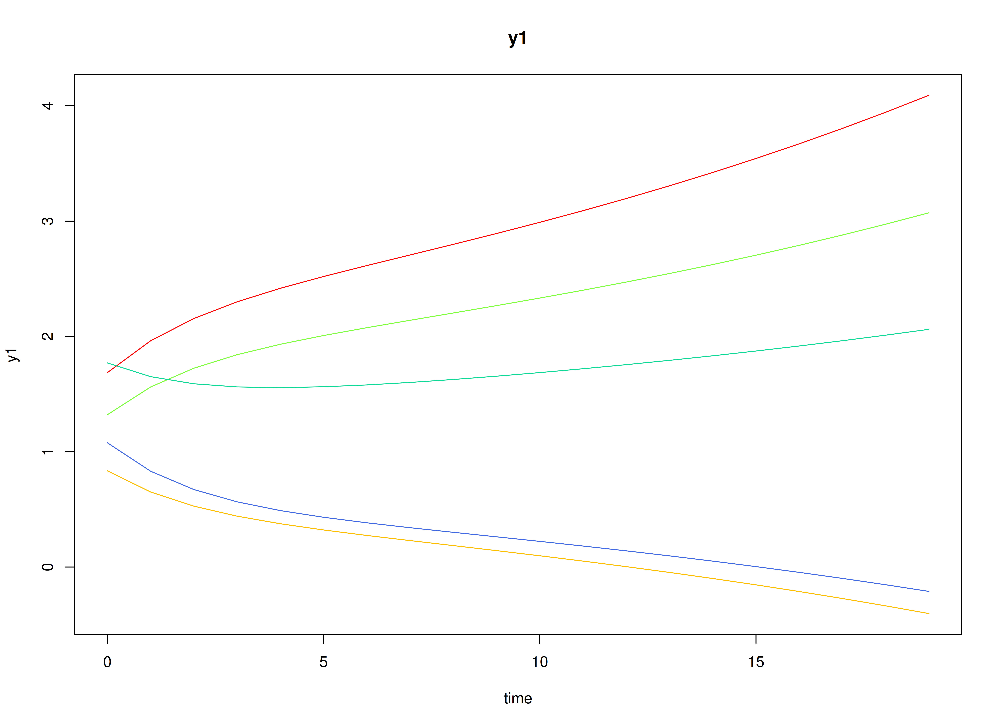
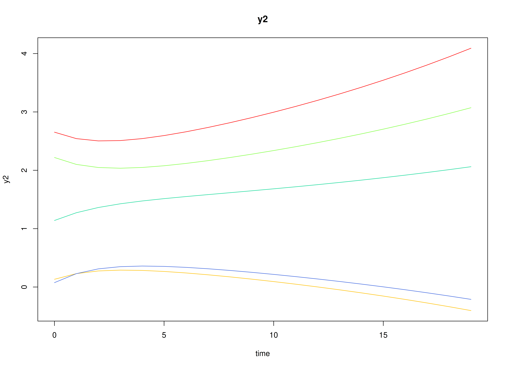

## Dynamics Description

The *Escalating Co-Activation* process represents a bivariate dynamic system in which two latent constructs---such as stress and rumination---mutually reinforce each other over time. Both constructs display strong autoregressive effects, indicating persistence, and positive cross-effects, suggesting that increases in one tend to amplify the other in subsequent time points.

At the population level, this pattern yields a slow return to equilibrium and, in some cases, near-unstable trajectories that can produce sustained co-activation or escalation. Between-person variability in the transition parameters captures individual differences in the strength of this self-reinforcing loop. The process noise covariance is relatively large and positively correlated, representing shared perturbations that drive both variables upward, while measurement error variance is moderate, reflecting realistic self-report imprecision.

This configuration models a *vicious cycle dynamic*---common in maladaptive emotional or cognitive processes---where mutual amplification between system components (e.g., stress and rumination) can sustain or exacerbate dysregulation over time.

## Model

The measurement model is given by
\begin{equation}
  \mathbf{y}_{i, t}
  =
  \boldsymbol{\nu}_{i}
  +
  \boldsymbol{\Lambda}
  \boldsymbol{\eta}_{i, t}
  +
  \boldsymbol{\varepsilon}_{i, t},
  \quad
  \mathrm{with}
  \quad
  \boldsymbol{\varepsilon}_{i, t}
  \sim
  \mathcal{N}
  \left(
  \mathbf{0},
  \boldsymbol{\Theta}_{i}
  \right)
\end{equation}
where
$\mathbf{y}_{i, t}$,
$\boldsymbol{\eta}_{i, t}$,
and
$\boldsymbol{\varepsilon}_{i, t}$
are random variables
and
$\boldsymbol{\nu}_{i}$,
$\boldsymbol{\Lambda}$,
and
$\boldsymbol{\Theta}_{i}$
are model parameters.
$\mathbf{y}_{i, t}$
represents a vector of observed random variables,
$\boldsymbol{\eta}_{i, t}$
a vector of latent random variables,
and
$\boldsymbol{\varepsilon}_{i, t}$
a vector of random measurement errors,
at time $t$ and individual $i$.
$\boldsymbol{\Lambda}$
denotes a matrix of factor loadings,
and
$\boldsymbol{\Theta}_{i}$
the covariance matrix of
$\boldsymbol{\varepsilon}$
for individual $i$.
In this model,
$\boldsymbol{\Lambda}$ is an identity matrix and
$\boldsymbol{\Theta}_{i}$ is a symmetric matrix.

The dynamic structure is given by
\begin{equation}
  \boldsymbol{\eta}_{i, t}
  =
  \boldsymbol{\beta}_{i}
  \boldsymbol{\eta}_{i, t - 1}
  +
  \boldsymbol{\zeta}_{i, t},
  \quad
  \mathrm{with}
  \quad
  \boldsymbol{\zeta}_{i, t}
  \sim
  \mathcal{N}
  \left(
  \mathbf{0},
  \boldsymbol{\Psi}_{i}
  \right)
\end{equation}
where
$\boldsymbol{\eta}_{i, t}$,
$\boldsymbol{\eta}_{i, t - 1}$,
and
$\boldsymbol{\zeta}_{i, t}$
are random variables,
and
$\boldsymbol{\beta}_{i}$,
and
$\boldsymbol{\Psi}_{i}$
are model parameters.
Here,
$\boldsymbol{\eta}_{i, t}$
is a vector of latent variables
at time $t$ and individual $i$,
$\boldsymbol{\eta}_{i, t - 1}$
represents a vector of latent variables
at time $t - 1$ and individual $i$,
and
$\boldsymbol{\zeta}_{i, t}$
represents a vector of dynamic noise
at time $t$ and individual $i$.
$\boldsymbol{\beta}_{i}$ is
a matrix of autoregression
and cross regression coefficients
for individual $i$,
and
$\boldsymbol{\Psi}_{i}$
the covariance matrix of
$\boldsymbol{\zeta}_{i, t}$
for individual $i$.
In this model,
$\boldsymbol{\Psi}_{i}$ is a symmetric matrix.

## Data Generation

### Notation

Let $t = 11000$ be the number of time points and $n = 100$ be the number of individuals.

Let the measurement model intecept vector $\boldsymbol{\nu}$ be normally distributed with the following means

\begin{equation}
\left(
\begin{array}{c}
  1 \\
  1 \\
\end{array}
\right)
\end{equation}

and covariance matrix

\begin{equation}
\left(
\begin{array}{cc}
  0.25 & 0.2 \\
  0.2 & 0.25 \\
\end{array}
\right) .
\end{equation}

Let the factor loadings matrix $\boldsymbol{\Lambda}$ be given by

\begin{equation}
\boldsymbol{\Lambda}
=
\left(
\begin{array}{cc}
  1 & 0 \\
  0 & 1 \\
\end{array}
\right) .
\end{equation}

Let the measurement error covariance matrix $\boldsymbol{\Theta}$ be given by

\begin{equation}
\boldsymbol{\Theta}
=
\left(
\begin{array}{cc}
  0.5 & 0 \\
  0 & 0.5 \\
\end{array}
\right) .
\end{equation}

Let the initial condition
$\boldsymbol{\eta}_{0}$
be given by

\begin{equation}
\boldsymbol{\eta}_{0} \sim \mathcal{N} \left( \boldsymbol{\mu}_{\boldsymbol{\eta} \mid 0}, \boldsymbol{\Sigma}_{\boldsymbol{\eta} \mid 0} \right) .
\end{equation}

$\boldsymbol{\mu}_{\boldsymbol{\eta} \mid 0}$ and $\boldsymbol{\Sigma}_{\boldsymbol{\eta} \mid 0}$ are functions of $\boldsymbol{\alpha}$ and $\boldsymbol{\beta}$.

Let the transition matrix $\boldsymbol{\beta}$ be normally distributed with the following means

\begin{equation}
\left(
\begin{array}{cc}
  0.8 & 0.25 \\
  0.2 & 0.85 \\
\end{array}
\right)
\end{equation}

and covariance matrix

\begin{equation}
\left(
\begin{array}{cccc}
  0.04 & 0.02 & 0.015 & 0.01 \\
  0.02 & 0.03 & 0.01 & 0.015 \\
  0.015 & 0.01 & 0.03 & 0.02 \\
  0.01 & 0.015 & 0.02 & 0.04 \\
\end{array}
\right) .
\end{equation}

Let the intercept vector $\boldsymbol{\alpha}$ be fixed to a zero vector.

The `SimNuN` and `SimBetaN` functions from the `simStateSpace` package generates random intercept vectors and transition matrices from the multivariate normal distribution. Note that the `SimBetaN` function generates transition matrices that are weakly stationary with an option to set lower and upper bounds.

Let the dynamic process noise $\boldsymbol{\Psi}$ be given by

\begin{equation}
\boldsymbol{\Psi}
=
\left(
\begin{array}{cc}
  0.35 & 0.2 \\
  0.2 & 0.4 \\
\end{array}
\right) .
\end{equation}


### R Function Arguments


``` r
n
#> [1] 100
time
#> [1] 11000
burnin
#> [1] 10000
# first mu0 in the list of length n
mu0[[1]]
#> [1] 0 0
# first sigma0 in the list of length n
sigma0[[1]]
#>           [,1]      [,2]
#> [1,] 0.4390926 0.2988029
#> [2,] 0.2988029 0.7801401
# first sigma0_l in the list of length n
sigma0_l[[1]] # sigma0_l <- t(chol(sigma0))
#>           [,1]      [,2]
#> [1,] 0.6626406 0.0000000
#> [2,] 0.4509276 0.7594764
alpha
#> [[1]]
#> [1] 0 0
# first beta in the list of length n
beta[[1]]
#>            [,1]       [,2]
#> [1,]  0.3978376 0.06747857
#> [2,] -0.1527304 0.74955797
# first psi in the list of length n
psi[[1]]
#>      [,1] [,2]
#> [1,] 0.35  0.2
#> [2,] 0.20  0.4
psi_l[[1]] # psi_l <- t(chol(psi))
#>           [,1]      [,2]
#> [1,] 0.5916080 0.0000000
#> [2,] 0.3380617 0.5345225
# first nu in the list of length n
nu[[1]]
#> [1] 1.224772 1.229428
lambda
#> [[1]]
#>      [,1] [,2]
#> [1,]    1    0
#> [2,]    0    1
# first theta in the list of length n
theta[[1]]
#>      [,1] [,2]
#> [1,]  0.5  0.0
#> [2,]  0.0  0.5
theta_l[[1]] # theta_l <- t(chol(theta))
#>           [,1]      [,2]
#> [1,] 0.7071068 0.0000000
#> [2,] 0.0000000 0.7071068
```

### Visualizing the Dynamics Without Process Noise and Measurement Error (n = 5 with Different Initial Condition)



### Using the `SimSSMIVary` Function from the `simStateSpace` Package to Simulate Data


``` r
library(simStateSpace)
sim <- SimSSMIVary(
  n = n,
  time = time,
  mu0 = mu0,
  sigma0_l = sigma0_l,
  alpha = alpha,
  beta = beta,
  psi_l = psi_l,
  nu = nu,
  lambda = lambda,
  theta_l = theta_l
)
data <- as.data.frame(sim, burnin = burnin)
head(data)
#>   id time        y1         y2
#> 1  1    0 2.2422584  2.2786663
#> 2  1    1 1.1771161  0.2379556
#> 3  1    2 0.7207619  0.8442931
#> 4  1    3 2.3190264  1.7270009
#> 5  1    4 0.7824021  0.2003718
#> 6  1    5 0.3012299 -0.1346925
plot(sim, burnin = burnin)
```


## Model Fitting


``` r
library(OpenMx)
library(fitDTVARMxID)
```

The `FitDTVARMxID` function fits a DT-VAR model on each individual $i$.
To set up the estimation, we first provide **starting values** for each parameter matrix.

### Autoregressive Parameters (`beta`)

The autoregressive coefficient matrix $\boldsymbol{\beta}$ is given starting values.


``` r
beta_values <- beta
```

### Intercepts (`nu`)

The intercept vector $\boldsymbol{\nu}$ is initialized with starting values.


``` r
nu_values <- nu
```

### LDL′-parameterized covariance matrices

Covariances such as `psi` and `theta` are estimated using the LDL′ decomposition of a positive definite covariance matrix. The decomposition expresses a covariance matrix $\Sigma$ as

\begin{equation}
  \boldsymbol{\Sigma} = \left( \mathbf{L} + \mathbf{I} \right) \mathrm{diag} \left( \mathrm{Softplus} \left( \mathbf{d}_{uc} \right) \right) \left( \mathbf{L} + \mathbf{I} \right)^{\prime},
\end{equation}

where:

- $\mathbf{L}$ is a strictly lower-triangular matrix of free parameters (`l_mat_strict`),
- $\mathbf{I}$ is the identity matrix,
- $\mathbf{d}_{uc}$ is an unconstrained vector,
- $\mathrm{Softplus} \left(\mathbf{d}_{uc} \right) = \log \left(1 + \exp \left( \mathbf{d}_{uc} \right) \right)$ ensures strictly positive diagonal entries.

The `LDL()` function extracts this decomposition from a positive definite covariance matrix. It returns:

- `d_uc`: unconstrained diagonal parameters, equal to `InvSoftplus(d_vec)`,
- `d_vec`: diagonal entries, equal to `Softplus(d_uc)`,
- `l_mat_strict`: the strictly lower-triangular factor.


``` r
sigma <- matrix(
  data = c(1.0, 0.5, 0.5, 1.0),
  nrow = 2,
  ncol = 2
)

ldl_sigma <- LDL(sigma)
d_uc <- ldl_sigma$d_uc
l_mat_strict <- ldl_sigma$l_mat_strict
I <- diag(2)
sigma_reconstructed <- (l_mat_strict + I) %*% diag(log1p(exp(d_uc)), 2) %*% t(l_mat_strict + I)
sigma_reconstructed
#>      [,1] [,2]
#> [1,]  1.0  0.5
#> [2,]  0.5  1.0
```

#### Process Noise Covariance Matrix (`psi`)

Starting values for the process noise covariance matrix $\boldsymbol{\Psi}$ are given below, with corresponding LDL′ parameters.


``` r
psi_values <- psi[[1]]
ldl_psi_values <- LDL(psi_values)
psi_d_values <- ldl_psi_values$d_uc
psi_l_values <- ldl_psi_values$l_mat_strict
```


``` r
psi_d_values
#> [1] -0.8697232 -1.1065068
```


``` r
psi_l_values
#>           [,1] [,2]
#> [1,] 0.0000000    0
#> [2,] 0.5714286    0
```

#### Measurement Error Covariance Matrix (`theta`)

Starting values for the measurement error covariance matrix $\boldsymbol{\Theta}$ are given below, with corresponding LDL′ parameters.


``` r
theta_values <- theta[[1]]
ldl_theta_values <- LDL(theta_values)
theta_d_values <- ldl_theta_values$d_uc
theta_l_values <- ldl_theta_values$l_mat_strict
```


``` r
theta_d_values
#> [1] -0.4327521 -0.4327521
```


``` r
theta_l_values
#>      [,1] [,2]
#> [1,]    0    0
#> [2,]    0    0
```

### Initial mean vector (`mu_0`) and covariance matrix (`sigma_0`)

The initial mean vector $\boldsymbol{\mu_0}$ and covariance matrix $\boldsymbol{\Sigma_0}$
are fixed using `mu0` and `sigma0`.


``` r
mu0_values <- mu0
```


``` r
sigma0_values <- lapply(
  X = sigma0,
  FUN = LDL
)
sigma0_d_values <- lapply(
  X = sigma0_values,
  FUN = function(i) {
    i$d_uc
  }
)
sigma0_l_values <- lapply(
  X = sigma0_values,
  FUN = function(i) {
    i$l_mat_strict
  }
)
```

### `FitDTVARMxID`


``` r
fit <- FitDTVARMxID(
  data = data,
  observed = c("y1", "y2"),
  id = "id",
  beta_values = beta_values,
  psi_d_values = psi_d_values,
  psi_l_values = psi_l_values,
  nu_values = nu_values,
  theta_d_values = theta_d_values,
  mu0_values = mu0_values,
  sigma0_d_values = sigma0_d_values,
  sigma0_l_values = sigma0_l_values,
  ncores = parallel::detectCores()
)
```

#### Parameter estimates


``` r
summary(fit, converged = FALSE)
#>                               beta_1_1     beta_2_1     beta_1_2  beta_2_2
#> FitDTVARMxID_DTVAR_ID1.Rds   0.3717081 -0.168534492  0.045707197 0.7244039
#> FitDTVARMxID_DTVAR_ID2.Rds   0.4108049 -0.118972000  0.100087133 0.8924329
#> FitDTVARMxID_DTVAR_ID3.Rds   0.9313239  0.114890406 -0.004024263 0.6699041
#> FitDTVARMxID_DTVAR_ID4.Rds   0.5116778  0.089627878  0.021855109 0.7602208
#> FitDTVARMxID_DTVAR_ID5.Rds   0.8340478  0.251706592  0.083522242 0.6421468
#> FitDTVARMxID_DTVAR_ID6.Rds   0.9723127  0.324536722 -0.113425876 0.6638050
#> FitDTVARMxID_DTVAR_ID7.Rds   0.8766739  0.413034546  0.018264106 0.5886868
#> FitDTVARMxID_DTVAR_ID8.Rds   0.8369436  0.050430865  0.124798603 0.4097471
#> FitDTVARMxID_DTVAR_ID9.Rds   0.2415280 -0.190685679 -0.005295853 0.5186270
#> FitDTVARMxID_DTVAR_ID10.Rds  0.6119887 -0.192822900  0.295495147 1.0686783
#> FitDTVARMxID_DTVAR_ID11.Rds  0.5703100  0.110535902  0.122442917 0.7312528
#> FitDTVARMxID_DTVAR_ID12.Rds  0.5435253  0.097778419  0.287235268 0.8026431
#> FitDTVARMxID_DTVAR_ID13.Rds  0.7736900 -0.001244324  0.229436233 0.8281172
#> FitDTVARMxID_DTVAR_ID14.Rds  0.3562721  0.220056261  0.328367364 0.6938195
#> FitDTVARMxID_DTVAR_ID15.Rds  0.6640880  0.026241834  0.526042329 0.6406804
#> FitDTVARMxID_DTVAR_ID16.Rds  0.6820634  0.034223807 -0.149886934 0.6201003
#> FitDTVARMxID_DTVAR_ID17.Rds  0.7836852  0.012099079  0.315594420 0.7963497
#> FitDTVARMxID_DTVAR_ID18.Rds  0.7194233  0.209959881  0.204453961 0.6832105
#> FitDTVARMxID_DTVAR_ID19.Rds  0.7201637 -0.154718752  0.146193362 0.4995439
#> FitDTVARMxID_DTVAR_ID20.Rds  0.7593444  0.066353183  0.067764220 0.5211940
#> FitDTVARMxID_DTVAR_ID21.Rds  0.6252293 -0.053995071  0.063675685 0.5251285
#> FitDTVARMxID_DTVAR_ID22.Rds  0.6495101  0.025776129  0.243270771 0.8070879
#> FitDTVARMxID_DTVAR_ID23.Rds  0.5728609 -0.116419895  0.133085118 0.6159725
#> FitDTVARMxID_DTVAR_ID24.Rds  0.7563131  0.347192210 -0.106563999 0.3702950
#> FitDTVARMxID_DTVAR_ID25.Rds  0.5926314  0.021171260  0.215219036 0.9145922
#> FitDTVARMxID_DTVAR_ID26.Rds  0.8477868 -0.031406874  0.397069675 0.6825891
#> FitDTVARMxID_DTVAR_ID27.Rds  0.7504220 -0.284717711  0.292761832 0.9552872
#> FitDTVARMxID_DTVAR_ID28.Rds  0.6186530 -0.123213192  0.029249008 0.6447804
#> FitDTVARMxID_DTVAR_ID29.Rds  0.8094758  0.058300279  0.216073736 0.8417329
#> FitDTVARMxID_DTVAR_ID30.Rds  0.7440168  0.120171656 -0.025489607 0.8389033
#> FitDTVARMxID_DTVAR_ID31.Rds  0.7462364 -0.003483914  0.093398078 0.7976744
#> FitDTVARMxID_DTVAR_ID32.Rds  0.8060101  0.116182195  0.147224740 0.4097419
#> FitDTVARMxID_DTVAR_ID33.Rds  0.7894888  0.055185203  0.110159697 0.5445496
#> FitDTVARMxID_DTVAR_ID34.Rds  0.6772478  0.288089599 -0.029482399 0.6975588
#> FitDTVARMxID_DTVAR_ID35.Rds  0.6036830 -0.209241026  0.265705866 0.9337107
#> FitDTVARMxID_DTVAR_ID36.Rds  0.4666011 -0.136729324 -0.003585151 0.7691777
#> FitDTVARMxID_DTVAR_ID37.Rds  0.6653668  0.047591952  0.179679224 0.7872605
#> FitDTVARMxID_DTVAR_ID38.Rds  0.6641733 -0.055694602  0.155532407 0.8966216
#> FitDTVARMxID_DTVAR_ID39.Rds  0.6405757 -0.302013444  0.195714202 0.7924762
#> FitDTVARMxID_DTVAR_ID40.Rds  0.7622729  0.297459838 -0.018172433 0.7374357
#> FitDTVARMxID_DTVAR_ID41.Rds  0.7778475  0.013102829  0.370278253 0.7469124
#> FitDTVARMxID_DTVAR_ID42.Rds  0.7130943  0.136423957 -0.019876554 0.7297596
#> FitDTVARMxID_DTVAR_ID43.Rds  0.8648823 -0.114148366  0.140103344 0.6651149
#> FitDTVARMxID_DTVAR_ID44.Rds  0.7873659 -0.027610888  0.244555491 0.6412804
#> FitDTVARMxID_DTVAR_ID45.Rds  0.7316377  0.141682741  0.331499284 0.7337986
#> FitDTVARMxID_DTVAR_ID46.Rds  0.5048889 -0.067335500  0.321003893 0.6848431
#> FitDTVARMxID_DTVAR_ID47.Rds  0.8779981 -0.044306982  0.256361552 0.7221457
#> FitDTVARMxID_DTVAR_ID48.Rds  0.8233538 -0.066723273  0.364719204 0.6811430
#> FitDTVARMxID_DTVAR_ID49.Rds  0.4007145  0.080907324 -0.233913373 0.9414684
#> FitDTVARMxID_DTVAR_ID50.Rds  0.6755018  0.239687737  0.059425211 0.8682690
#> FitDTVARMxID_DTVAR_ID51.Rds  0.4500045 -0.038286086  0.442407858 0.8470741
#> FitDTVARMxID_DTVAR_ID52.Rds  0.6044796 -0.072073444  0.111576199 0.5864655
#> FitDTVARMxID_DTVAR_ID53.Rds  0.8179393 -0.091137983  0.382969296 0.7973288
#> FitDTVARMxID_DTVAR_ID54.Rds  0.7562846 -0.085206180  0.242174554 0.7037632
#> FitDTVARMxID_DTVAR_ID55.Rds  0.5897501  0.067787705 -0.133361636 0.3913412
#> FitDTVARMxID_DTVAR_ID56.Rds  0.6219827 -0.010127715 -0.150321185 0.6157367
#> FitDTVARMxID_DTVAR_ID57.Rds  0.5499462 -0.128514591  0.133522263 0.6858552
#> FitDTVARMxID_DTVAR_ID58.Rds  0.2460012  0.024181109  0.163317053 0.7492896
#> FitDTVARMxID_DTVAR_ID59.Rds  0.5249710  0.293180678 -0.036521589 0.5509147
#> FitDTVARMxID_DTVAR_ID60.Rds  0.7100902  0.144923791 -0.021536255 0.8872136
#> FitDTVARMxID_DTVAR_ID61.Rds  0.6829206 -0.001280510  0.182466569 0.5967528
#> FitDTVARMxID_DTVAR_ID62.Rds  1.0127632  0.317226221 -0.083469119 0.7881778
#> FitDTVARMxID_DTVAR_ID63.Rds  0.7262706  0.091672072  0.131363150 0.4488123
#> FitDTVARMxID_DTVAR_ID64.Rds  0.8896402  0.164445827  0.026651378 0.7671339
#> FitDTVARMxID_DTVAR_ID65.Rds  0.8276813  0.213292293  0.063775004 0.6811568
#> FitDTVARMxID_DTVAR_ID66.Rds  0.8034069  0.012678371  0.310741149 0.5551537
#> FitDTVARMxID_DTVAR_ID67.Rds  0.7732213  0.187812842  0.014768711 0.7184338
#> FitDTVARMxID_DTVAR_ID68.Rds  0.5192359  0.158308918  0.335293294 0.6465131
#> FitDTVARMxID_DTVAR_ID69.Rds  0.5009313 -0.112708151  0.281578208 0.7660147
#> FitDTVARMxID_DTVAR_ID70.Rds  0.8041094  0.461831889 -0.001241922 0.6740074
#> FitDTVARMxID_DTVAR_ID71.Rds  0.8577751  0.481786521  0.064339685 0.4888050
#> FitDTVARMxID_DTVAR_ID72.Rds  0.6465945  0.328092530  0.238994329 0.4936445
#> FitDTVARMxID_DTVAR_ID73.Rds  0.8635509  0.364851114  0.054675125 0.5810011
#> FitDTVARMxID_DTVAR_ID74.Rds  0.5333078 -0.077008888  0.328906352 0.6822866
#> FitDTVARMxID_DTVAR_ID75.Rds  0.6057727  0.015413297  0.264188638 0.7651282
#> FitDTVARMxID_DTVAR_ID76.Rds  0.6688927  0.115394216 -0.024687535 0.6198296
#> FitDTVARMxID_DTVAR_ID77.Rds  0.8409738  0.013176609 -0.058578484 0.6933800
#> FitDTVARMxID_DTVAR_ID78.Rds  0.4168578 -0.148690974  0.361068716 1.0338260
#> FitDTVARMxID_DTVAR_ID79.Rds  0.4250650 -0.069034389  0.236618736 0.6115075
#> FitDTVARMxID_DTVAR_ID80.Rds  0.7240630 -0.085184620  0.186059155 0.8459862
#> FitDTVARMxID_DTVAR_ID81.Rds  0.1454204  0.090994584  0.188684078 0.8161040
#> FitDTVARMxID_DTVAR_ID82.Rds  0.7370698  0.296071354  0.146810316 0.6858589
#> FitDTVARMxID_DTVAR_ID83.Rds  0.6437138 -0.053240284  0.190769742 0.8644890
#> FitDTVARMxID_DTVAR_ID84.Rds  0.5595668  0.140662000  0.116156487 0.8428089
#> FitDTVARMxID_DTVAR_ID85.Rds  0.3113211 -0.047819741  0.118530662 0.7009335
#> FitDTVARMxID_DTVAR_ID86.Rds  0.9035016 -0.045359534  0.348221882 0.8279883
#> FitDTVARMxID_DTVAR_ID87.Rds  0.7383649  0.070157361  0.032754267 0.5571910
#> FitDTVARMxID_DTVAR_ID88.Rds  0.7783715  0.310654489 -0.219771613 0.7762367
#> FitDTVARMxID_DTVAR_ID89.Rds  0.4809042 -0.004107954 -0.025157607 0.6243310
#> FitDTVARMxID_DTVAR_ID90.Rds  0.7736859  0.063922917  0.325735490 0.4749212
#> FitDTVARMxID_DTVAR_ID91.Rds  0.9718796  0.487569611 -0.116119556 0.3711478
#> FitDTVARMxID_DTVAR_ID92.Rds  0.5638150  0.194141200  0.089475515 0.7249197
#> FitDTVARMxID_DTVAR_ID93.Rds  0.9350621  0.131585768 -0.005035468 0.8594245
#> FitDTVARMxID_DTVAR_ID94.Rds  0.3171853  0.087807929  0.081582298 0.7516137
#> FitDTVARMxID_DTVAR_ID95.Rds  0.4115016 -0.301205709  0.454877567 0.9761728
#> FitDTVARMxID_DTVAR_ID96.Rds  0.7121936 -0.130938346  0.116825211 0.7792499
#> FitDTVARMxID_DTVAR_ID97.Rds  0.7957665  0.152877022  0.177498426 0.7375500
#> FitDTVARMxID_DTVAR_ID98.Rds  0.6893820 -0.075508925 -0.119804943 0.2497206
#> FitDTVARMxID_DTVAR_ID99.Rds  0.8079436  0.369666014 -0.025854208 0.5943485
#> FitDTVARMxID_DTVAR_ID100.Rds 0.5686536 -0.026888052  0.326470994 0.7659032
#>                                 nu_1_1      nu_2_1 psi_l_2_1   psi_d_1_1
#> FitDTVARMxID_DTVAR_ID1.Rds   1.2324784  1.32043274 0.4626773 -0.68745168
#> FitDTVARMxID_DTVAR_ID2.Rds   0.9995594  1.17367085 0.3463459 -0.31000851
#> FitDTVARMxID_DTVAR_ID3.Rds   1.0089452  1.12196016 0.5629971 -1.05432882
#> FitDTVARMxID_DTVAR_ID4.Rds   0.1342039 -0.03580787 0.4988124 -1.00255063
#> FitDTVARMxID_DTVAR_ID5.Rds   0.6282729  0.41228175 0.5977230 -1.09871278
#> FitDTVARMxID_DTVAR_ID6.Rds   2.5186054  1.61527784 0.6568119 -1.40759276
#> FitDTVARMxID_DTVAR_ID7.Rds   1.3862925  1.54732078 0.5727426 -0.81260116
#> FitDTVARMxID_DTVAR_ID8.Rds   0.7149527  0.70254584 0.6342672 -0.99823191
#> FitDTVARMxID_DTVAR_ID9.Rds   0.7113683  1.28808495 0.3990535 -0.41734456
#> FitDTVARMxID_DTVAR_ID10.Rds  0.1825190  0.80708350 0.6276604 -0.88895672
#> FitDTVARMxID_DTVAR_ID11.Rds  1.3698414  1.27029391 0.3874375 -0.72904709
#> FitDTVARMxID_DTVAR_ID12.Rds  0.9457534  0.35137559 0.5491027 -1.06580947
#> FitDTVARMxID_DTVAR_ID13.Rds  1.0364734  1.08151059 0.4524100 -0.68155721
#> FitDTVARMxID_DTVAR_ID14.Rds  1.9167885  1.75261668 0.3448161 -0.03393193
#> FitDTVARMxID_DTVAR_ID15.Rds  0.6610572  0.85091107 0.5295682 -1.01773873
#> FitDTVARMxID_DTVAR_ID16.Rds  1.1191129  1.25012795 0.5610238 -0.60524244
#> FitDTVARMxID_DTVAR_ID17.Rds  0.5055858  0.25599058 0.5721515 -1.03478863
#> FitDTVARMxID_DTVAR_ID18.Rds  1.6211509  0.82131832 0.5158945 -0.73438906
#> FitDTVARMxID_DTVAR_ID19.Rds  1.6506912  1.45082565 0.5619806 -0.71102689
#> FitDTVARMxID_DTVAR_ID20.Rds  2.1001936  2.19785324 0.7739223 -0.98570362
#> FitDTVARMxID_DTVAR_ID21.Rds  0.8958582  1.19354005 0.8475741 -1.44981799
#> FitDTVARMxID_DTVAR_ID22.Rds  0.7159592  0.46875438 0.5497417 -0.93139031
#> FitDTVARMxID_DTVAR_ID23.Rds  0.1581971  0.40832284 0.5380451 -0.66434376
#> FitDTVARMxID_DTVAR_ID24.Rds  1.1245610  1.37594267 0.8496576 -1.42507999
#> FitDTVARMxID_DTVAR_ID25.Rds  1.2304452  1.59007348 0.5437557 -0.62671153
#> FitDTVARMxID_DTVAR_ID26.Rds  0.6446312  1.04256263 0.5558243 -0.92500969
#> FitDTVARMxID_DTVAR_ID27.Rds  0.3460093  0.30518491 0.5464158 -0.94068183
#> FitDTVARMxID_DTVAR_ID28.Rds  0.7497568  0.32025623 0.5055653 -0.75346272
#> FitDTVARMxID_DTVAR_ID29.Rds  0.5259856  0.57782477 0.6845177 -1.09048187
#> FitDTVARMxID_DTVAR_ID30.Rds  1.0068966  0.72378277 0.7061440 -1.11972636
#> FitDTVARMxID_DTVAR_ID31.Rds  1.2495497  1.15203472 0.6004491 -0.80807098
#> FitDTVARMxID_DTVAR_ID32.Rds  1.2303983  1.54900169 0.5721677 -0.67340409
#> FitDTVARMxID_DTVAR_ID33.Rds  1.7962865  2.14033721 0.5750726 -0.96379845
#> FitDTVARMxID_DTVAR_ID34.Rds  0.9403845  0.72386985 0.5932362 -0.93839883
#> FitDTVARMxID_DTVAR_ID35.Rds  1.5439754  1.27842156 0.6210030 -0.86290404
#> FitDTVARMxID_DTVAR_ID36.Rds  2.1276484  2.06065950 0.4155370 -0.18980013
#> FitDTVARMxID_DTVAR_ID37.Rds  1.1315784  1.32859553 0.4585111 -0.71428606
#> FitDTVARMxID_DTVAR_ID38.Rds  1.2078614  1.13337361 0.5351963 -0.77922786
#> FitDTVARMxID_DTVAR_ID39.Rds  1.1467095  0.73833713 0.5057478 -0.83406240
#> FitDTVARMxID_DTVAR_ID40.Rds  1.2892901  1.34995407 0.6268497 -1.00270036
#> FitDTVARMxID_DTVAR_ID41.Rds  1.4950155  0.94624727 0.6217080 -0.92738789
#> FitDTVARMxID_DTVAR_ID42.Rds  1.4220565  1.14170884 0.6666435 -0.80145136
#> FitDTVARMxID_DTVAR_ID43.Rds  1.2693117  1.63817232 0.6220320 -1.06809195
#> FitDTVARMxID_DTVAR_ID44.Rds  1.5363173  1.68330863 0.6449311 -1.01703093
#> FitDTVARMxID_DTVAR_ID45.Rds  1.1778498  0.65683416 0.5488864 -0.91014022
#> FitDTVARMxID_DTVAR_ID46.Rds  1.5017053  1.63763806 0.5284126 -0.83808685
#> FitDTVARMxID_DTVAR_ID47.Rds  0.3131489  0.71995614 0.5205488 -1.16986909
#> FitDTVARMxID_DTVAR_ID48.Rds  1.5576848  1.34567700 0.8147393 -1.11261343
#> FitDTVARMxID_DTVAR_ID49.Rds  1.3557086  0.80520434 0.8655384 -1.72902678
#> FitDTVARMxID_DTVAR_ID50.Rds  1.8504067  0.92597899 0.5825850 -1.04221441
#> FitDTVARMxID_DTVAR_ID51.Rds  1.6822704  1.52077209 0.3902421 -0.61951021
#> FitDTVARMxID_DTVAR_ID52.Rds  1.8277557  1.54034730 0.5088729 -0.86096923
#> FitDTVARMxID_DTVAR_ID53.Rds  1.4866755  1.54122125 0.6384525 -1.26920586
#> FitDTVARMxID_DTVAR_ID54.Rds  0.0188313  0.56004872 0.5776108 -1.09368899
#> FitDTVARMxID_DTVAR_ID55.Rds  1.1155141  1.17378053 0.4751196 -0.84015878
#> FitDTVARMxID_DTVAR_ID56.Rds  0.6476305  0.68464069 0.6640211 -0.78714192
#> FitDTVARMxID_DTVAR_ID57.Rds  0.7137697  0.46783327 0.3965765 -0.52836214
#> FitDTVARMxID_DTVAR_ID58.Rds  1.3718512  1.54323761 0.3712314 -0.04127864
#> FitDTVARMxID_DTVAR_ID59.Rds  1.2755892  0.96472503 0.4871152 -0.64550979
#> FitDTVARMxID_DTVAR_ID60.Rds  1.3714151  1.53294062 0.6353600 -1.01466967
#> FitDTVARMxID_DTVAR_ID61.Rds  1.3104276  1.46495582 0.7341280 -1.08730551
#> FitDTVARMxID_DTVAR_ID62.Rds  0.6333512  0.57103575 0.7393153 -1.09458129
#> FitDTVARMxID_DTVAR_ID63.Rds  1.3298943  1.36027850 0.5246474 -0.76082718
#> FitDTVARMxID_DTVAR_ID64.Rds  0.5328555  0.69507103 0.4585003 -0.78502979
#> FitDTVARMxID_DTVAR_ID65.Rds  0.7178506  0.74605914 0.5845692 -0.81635362
#> FitDTVARMxID_DTVAR_ID66.Rds  1.0649901  0.75061306 0.5344305 -0.99830289
#> FitDTVARMxID_DTVAR_ID67.Rds  1.7931534  1.96675495 0.8875695 -1.28375654
#> FitDTVARMxID_DTVAR_ID68.Rds  1.1236707  1.12089005 0.4026654 -0.27668387
#> FitDTVARMxID_DTVAR_ID69.Rds  0.7603910  0.68911086 0.5606636 -0.88299683
#> FitDTVARMxID_DTVAR_ID70.Rds  0.8553440  1.35897476 0.6731587 -0.83023948
#> FitDTVARMxID_DTVAR_ID71.Rds  0.6087364  0.66547621 0.5705829 -0.88959666
#> FitDTVARMxID_DTVAR_ID72.Rds  0.9345166  0.59138971 0.5584267 -0.63285266
#> FitDTVARMxID_DTVAR_ID73.Rds  1.3005536  1.09857721 0.3992102 -0.84890254
#> FitDTVARMxID_DTVAR_ID74.Rds  0.0791130  0.28673469 0.4994470 -0.56687565
#> FitDTVARMxID_DTVAR_ID75.Rds  1.1933697  1.22134926 0.5380033 -0.95864179
#> FitDTVARMxID_DTVAR_ID76.Rds  1.2177417  1.03004106 0.6674559 -1.03772974
#> FitDTVARMxID_DTVAR_ID77.Rds  1.5448132  0.86864715 0.5679307 -0.74942084
#> FitDTVARMxID_DTVAR_ID78.Rds  1.1521400  1.14402469 0.4908125 -0.89216072
#> FitDTVARMxID_DTVAR_ID79.Rds  0.7324499  0.67612735 0.5232567 -0.67205876
#> FitDTVARMxID_DTVAR_ID80.Rds  1.2971115  1.05261154 0.6144275 -0.91496897
#> FitDTVARMxID_DTVAR_ID81.Rds  1.3629188  0.80818624 0.2344552  0.36960784
#> FitDTVARMxID_DTVAR_ID82.Rds  1.3103828  1.52225935 0.5592276 -0.83239396
#> FitDTVARMxID_DTVAR_ID83.Rds  0.9293836  1.08637484 0.7043800 -1.14262373
#> FitDTVARMxID_DTVAR_ID84.Rds  0.7390723  1.11864192 0.7583596 -1.28573969
#> FitDTVARMxID_DTVAR_ID85.Rds  0.5503250  0.95221381 0.4843406 -0.47989729
#> FitDTVARMxID_DTVAR_ID86.Rds  0.9252522  1.25440726 0.6150213 -1.19562488
#> FitDTVARMxID_DTVAR_ID87.Rds  0.7861598  1.05732406 0.7333759 -0.96014682
#> FitDTVARMxID_DTVAR_ID88.Rds  1.1977825  1.76901043 0.5794159 -0.63071097
#> FitDTVARMxID_DTVAR_ID89.Rds  1.0273884  1.16707074 0.7176043 -1.12833346
#> FitDTVARMxID_DTVAR_ID90.Rds  1.0601817  0.54179717 0.5487852 -0.67498926
#> FitDTVARMxID_DTVAR_ID91.Rds  1.1311438  1.51712334 0.4596554 -0.80212188
#> FitDTVARMxID_DTVAR_ID92.Rds  0.1739900  0.04341596 0.5409100 -0.73274232
#> FitDTVARMxID_DTVAR_ID93.Rds  1.2335862  1.48233534 0.6499285 -0.71461125
#> FitDTVARMxID_DTVAR_ID94.Rds  0.0155087  0.24968486 0.2482676  0.14877195
#> FitDTVARMxID_DTVAR_ID95.Rds  1.0297515  0.36457233 0.6195586 -1.05477645
#> FitDTVARMxID_DTVAR_ID96.Rds  1.2309030  1.31531603 0.9054337 -1.36726987
#> FitDTVARMxID_DTVAR_ID97.Rds  1.5428858  1.57122967 0.6051716 -1.04697842
#> FitDTVARMxID_DTVAR_ID98.Rds  1.7917418  2.22666118 0.9363507 -1.26492718
#> FitDTVARMxID_DTVAR_ID99.Rds  1.3756844  1.77531884 0.8675233 -1.44714405
#> FitDTVARMxID_DTVAR_ID100.Rds 0.6824964  0.91541254 0.4807374 -0.64325137
#>                               psi_d_2_1 theta_d_1_1 theta_d_2_1
#> FitDTVARMxID_DTVAR_ID1.Rds   -0.7215308  -0.5379546  -0.7779719
#> FitDTVARMxID_DTVAR_ID2.Rds   -1.4326054  -1.0250941  -0.2140067
#> FitDTVARMxID_DTVAR_ID3.Rds   -1.4680029  -0.2619313  -0.3305107
#> FitDTVARMxID_DTVAR_ID4.Rds   -0.7851566  -0.3899462  -0.4195511
#> FitDTVARMxID_DTVAR_ID5.Rds   -0.8321933  -0.3749672  -0.4831219
#> FitDTVARMxID_DTVAR_ID6.Rds   -1.6202568  -0.2933030  -0.2029447
#> FitDTVARMxID_DTVAR_ID7.Rds   -1.1493765  -0.5002189  -0.3581853
#> FitDTVARMxID_DTVAR_ID8.Rds   -1.0102277  -0.4378445  -0.3617036
#> FitDTVARMxID_DTVAR_ID9.Rds   -0.8259415  -0.7552779  -0.4740758
#> FitDTVARMxID_DTVAR_ID10.Rds  -1.6607634  -0.3324315  -0.4088454
#> FitDTVARMxID_DTVAR_ID11.Rds  -0.6232378  -0.5774328  -0.6851687
#> FitDTVARMxID_DTVAR_ID12.Rds  -1.0607027  -0.2673912  -0.3822569
#> FitDTVARMxID_DTVAR_ID13.Rds  -0.9593426  -0.5858106  -0.4897847
#> FitDTVARMxID_DTVAR_ID14.Rds  -0.4567603  -1.5102328  -0.6354874
#> FitDTVARMxID_DTVAR_ID15.Rds  -1.2096435  -0.3300064  -0.3442006
#> FitDTVARMxID_DTVAR_ID16.Rds  -1.4485732  -0.7526159  -0.3071061
#> FitDTVARMxID_DTVAR_ID17.Rds  -1.4457133  -0.4521083  -0.4283446
#> FitDTVARMxID_DTVAR_ID18.Rds  -0.7064275  -0.5155650  -0.5186904
#> FitDTVARMxID_DTVAR_ID19.Rds  -0.7872054  -0.5360039  -0.7304904
#> FitDTVARMxID_DTVAR_ID20.Rds  -0.7065845  -0.3309403  -0.9971727
#> FitDTVARMxID_DTVAR_ID21.Rds  -0.6273030  -0.2508980  -1.0320996
#> FitDTVARMxID_DTVAR_ID22.Rds  -2.2087222  -0.4096873   0.0199886
#> FitDTVARMxID_DTVAR_ID23.Rds  -1.1346546  -0.5848799  -0.4306215
#> FitDTVARMxID_DTVAR_ID24.Rds  -0.7256175  -0.1704303  -0.7937452
#> FitDTVARMxID_DTVAR_ID25.Rds  -1.0998632  -0.5867774  -0.3779196
#> FitDTVARMxID_DTVAR_ID26.Rds  -0.9827704  -0.3955795  -0.3534772
#> FitDTVARMxID_DTVAR_ID27.Rds  -0.9494232  -0.3612811  -0.4304405
#> FitDTVARMxID_DTVAR_ID28.Rds  -1.5666448  -0.4570696  -0.3569916
#> FitDTVARMxID_DTVAR_ID29.Rds  -1.6868275  -0.2588956  -0.2234816
#> FitDTVARMxID_DTVAR_ID30.Rds  -1.6515025  -0.3664154  -0.3463587
#> FitDTVARMxID_DTVAR_ID31.Rds  -1.2824260  -0.4944753  -0.3623546
#> FitDTVARMxID_DTVAR_ID32.Rds  -1.3252125  -0.4922502  -0.3275039
#> FitDTVARMxID_DTVAR_ID33.Rds  -1.0675274  -0.5313868  -0.3658002
#> FitDTVARMxID_DTVAR_ID34.Rds  -1.3160611  -0.3777164  -0.4051538
#> FitDTVARMxID_DTVAR_ID35.Rds  -1.1653200  -0.4048586  -0.4605406
#> FitDTVARMxID_DTVAR_ID36.Rds  -1.0252953  -1.4468869  -0.4371736
#> FitDTVARMxID_DTVAR_ID37.Rds  -1.0444034  -0.5134978  -0.4798361
#> FitDTVARMxID_DTVAR_ID38.Rds  -1.2799335  -0.6362160  -0.2716555
#> FitDTVARMxID_DTVAR_ID39.Rds  -1.1332696  -0.5567623  -0.2699569
#> FitDTVARMxID_DTVAR_ID40.Rds  -0.9692780  -0.2933145  -0.5684037
#> FitDTVARMxID_DTVAR_ID41.Rds  -1.2628031  -0.3896713  -0.2613801
#> FitDTVARMxID_DTVAR_ID42.Rds  -1.9946394  -0.5287422  -0.1799537
#> FitDTVARMxID_DTVAR_ID43.Rds  -1.5606713  -0.3807198  -0.2033270
#> FitDTVARMxID_DTVAR_ID44.Rds  -0.5864836  -0.4305345  -0.6271681
#> FitDTVARMxID_DTVAR_ID45.Rds  -1.5628192  -0.4663427  -0.3033569
#> FitDTVARMxID_DTVAR_ID46.Rds  -1.0651028  -0.4812149  -0.2626022
#> FitDTVARMxID_DTVAR_ID47.Rds  -1.0492920  -0.3707180  -0.4037258
#> FitDTVARMxID_DTVAR_ID48.Rds  -1.2628801  -0.3738582  -0.3246046
#> FitDTVARMxID_DTVAR_ID49.Rds  -1.0329014  -0.1344790  -0.5201076
#> FitDTVARMxID_DTVAR_ID50.Rds  -1.2951963  -0.4438923  -0.4165153
#> FitDTVARMxID_DTVAR_ID51.Rds  -0.9377069  -0.6733307  -0.3112458
#> FitDTVARMxID_DTVAR_ID52.Rds  -1.0872506  -0.4529584  -0.3202975
#> FitDTVARMxID_DTVAR_ID53.Rds  -1.2321042  -0.3133480  -0.4127334
#> FitDTVARMxID_DTVAR_ID54.Rds  -0.8758122  -0.3826909  -0.5752143
#> FitDTVARMxID_DTVAR_ID55.Rds  -0.8521762  -0.2562074  -0.4108798
#> FitDTVARMxID_DTVAR_ID56.Rds  -0.7383261  -0.4672195  -0.6894424
#> FitDTVARMxID_DTVAR_ID57.Rds  -1.1004232  -0.7373102  -0.3616731
#> FitDTVARMxID_DTVAR_ID58.Rds  -0.9042110  -1.1759314  -0.4015525
#> FitDTVARMxID_DTVAR_ID59.Rds  -0.7500814  -0.6064477  -0.5849153
#> FitDTVARMxID_DTVAR_ID60.Rds  -1.2924933  -0.3175447  -0.5069287
#> FitDTVARMxID_DTVAR_ID61.Rds  -1.0354575  -0.2592022  -0.5533872
#> FitDTVARMxID_DTVAR_ID62.Rds  -0.9524416  -0.3162354  -0.5701249
#> FitDTVARMxID_DTVAR_ID63.Rds  -0.8018826  -0.5318466  -0.6079549
#> FitDTVARMxID_DTVAR_ID64.Rds  -0.6973370  -0.3617207  -0.6050376
#> FitDTVARMxID_DTVAR_ID65.Rds  -0.6438502  -0.4908077  -0.6533136
#> FitDTVARMxID_DTVAR_ID66.Rds  -1.3746057  -0.5291653  -0.1810952
#> FitDTVARMxID_DTVAR_ID67.Rds  -1.1550953  -0.2273206  -0.6809803
#> FitDTVARMxID_DTVAR_ID68.Rds  -0.7011873  -0.8338275  -0.5485588
#> FitDTVARMxID_DTVAR_ID69.Rds  -1.1276348  -0.5101329  -0.4974755
#> FitDTVARMxID_DTVAR_ID70.Rds  -0.9447817  -0.5733023  -0.4351138
#> FitDTVARMxID_DTVAR_ID71.Rds  -0.7246880  -0.3843679  -0.7940135
#> FitDTVARMxID_DTVAR_ID72.Rds  -1.2309516  -0.5287261  -0.3682624
#> FitDTVARMxID_DTVAR_ID73.Rds  -0.4568970  -0.4296897  -1.0172016
#> FitDTVARMxID_DTVAR_ID74.Rds  -1.2895716  -0.5495557  -0.3488333
#> FitDTVARMxID_DTVAR_ID75.Rds  -0.6581979  -0.5261915  -0.7048840
#> FitDTVARMxID_DTVAR_ID76.Rds  -1.4245174  -0.3224263  -0.4093395
#> FitDTVARMxID_DTVAR_ID77.Rds  -2.3418332  -0.4929939  -0.0997436
#> FitDTVARMxID_DTVAR_ID78.Rds  -1.3057797  -0.4909746  -0.3078704
#> FitDTVARMxID_DTVAR_ID79.Rds  -1.1730240  -0.6049470  -0.3697375
#> FitDTVARMxID_DTVAR_ID80.Rds  -1.0689139  -0.3893146  -0.4676049
#> FitDTVARMxID_DTVAR_ID81.Rds  -0.9231062 -17.3012732  -0.2352637
#> FitDTVARMxID_DTVAR_ID82.Rds  -1.0383185  -0.5538309  -0.4977856
#> FitDTVARMxID_DTVAR_ID83.Rds  -1.7382758  -0.3766271  -0.2587688
#> FitDTVARMxID_DTVAR_ID84.Rds  -1.3101805  -0.1657679  -0.4778366
#> FitDTVARMxID_DTVAR_ID85.Rds  -1.3416759  -0.6343847  -0.5074851
#> FitDTVARMxID_DTVAR_ID86.Rds  -1.1154418  -0.2555106  -0.5323920
#> FitDTVARMxID_DTVAR_ID87.Rds  -0.9252499  -0.3991440  -0.5510775
#> FitDTVARMxID_DTVAR_ID88.Rds  -1.2680554  -0.5936366  -0.3471271
#> FitDTVARMxID_DTVAR_ID89.Rds  -1.4686106  -0.2739798  -0.3449677
#> FitDTVARMxID_DTVAR_ID90.Rds  -0.7890842  -0.5245222  -0.6123156
#> FitDTVARMxID_DTVAR_ID91.Rds  -1.0670832  -0.3579652  -0.4468074
#> FitDTVARMxID_DTVAR_ID92.Rds  -0.8234130  -0.6346305  -0.6680939
#> FitDTVARMxID_DTVAR_ID93.Rds  -0.9082251  -0.5202032  -0.3916542
#> FitDTVARMxID_DTVAR_ID94.Rds  -1.0685357  -1.7369237  -0.3888129
#> FitDTVARMxID_DTVAR_ID95.Rds  -1.7516734  -0.3296283  -0.2911605
#> FitDTVARMxID_DTVAR_ID96.Rds  -1.2316834  -0.2847641  -0.3521368
#> FitDTVARMxID_DTVAR_ID97.Rds  -1.1407613  -0.3137510  -0.4163157
#> FitDTVARMxID_DTVAR_ID98.Rds  -1.0093132  -0.1726867  -0.6748256
#> FitDTVARMxID_DTVAR_ID99.Rds  -1.3071080  -0.1703125  -0.6646625
#> FitDTVARMxID_DTVAR_ID100.Rds -1.2519100  -0.6687428  -0.2298904
```

#### Proportion of converged cases


``` r
converged(
  fit,
  theta_tol = 0.01,
  prop = TRUE
)
#> [1] 0.99
```

#### Meta-analyze the measurement error covariance matrix for the converged cases


``` r
library(metaVAR)
fixed_theta <- MetaVARMx(
  fit,
  random = FALSE,
  effects = FALSE,
  cov_meas = TRUE,
  theta_tol = 0.01
)
```




``` r
coef(fixed_theta)
#>  alpha_1_1  alpha_2_1
#> -0.4040038 -0.3980323
summary(fixed_theta)
#>               est     se        z p    2.5%   97.5%
#> alpha[1,1] -0.404 0.0145 -27.8066 0 -0.4325 -0.3755
#> alpha[2,1] -0.398 0.0160 -24.8070 0 -0.4295 -0.3666
```


``` r
theta_d_values <- coef(fixed_theta)
```

#### Refit the model with fixed measurement error covariance matrix


``` r
fit <- FitDTVARMxID(
  data = data,
  observed = c("y1", "y2"),
  id = "id",
  beta_values = beta_values,
  psi_d_values = psi_d_values,
  psi_l_values = psi_l_values,
  nu_values = nu_values,
  theta_fixed = TRUE,
  theta_d_values = theta_d_values,
  mu0_values = mu0_values,
  sigma0_d_values = sigma0_d_values,
  sigma0_l_values = sigma0_l_values,
  ncores = parallel::detectCores()
)
```

#### Parameter estimates


``` r
random <- MetaVARMx(
  fit,
  effects = TRUE,
  int_meas = TRUE
)
```



``` r
summary(random)
#>                  est     se        z      p    2.5%   97.5%
#> alpha[1,1]    0.6969 0.0145  47.9394 0.0000  0.6684  0.7254
#> alpha[2,1]    0.0470 0.0165   2.8554 0.0043  0.0147  0.0793
#> alpha[3,1]    0.1176 0.0149   7.9119 0.0000  0.0885  0.1468
#> alpha[4,1]    0.7161 0.0138  52.0621 0.0000  0.6892  0.7431
#> alpha[5,1]    1.0892 0.0490  22.2089 0.0000  0.9931  1.1854
#> alpha[6,1]    1.0800 0.0493  21.9227 0.0000  0.9835  1.1766
#> tau_sqr[1,1]  0.0181 0.0030   6.0167 0.0000  0.0122  0.0241
#> tau_sqr[2,1]  0.0088 0.0026   3.3740 0.0007  0.0037  0.0139
#> tau_sqr[3,1]  0.0009 0.0021   0.4268 0.6695 -0.0033  0.0051
#> tau_sqr[4,1] -0.0030 0.0020  -1.5180 0.1290 -0.0069  0.0009
#> tau_sqr[5,1]  0.0058 0.0071   0.8134 0.4160 -0.0081  0.0197
#> tau_sqr[6,1]  0.0055 0.0072   0.7672 0.4429 -0.0086  0.0196
#> tau_sqr[2,2]  0.0239 0.0039   6.1908 0.0000  0.0164  0.0315
#> tau_sqr[3,2] -0.0098 0.0026  -3.7491 0.0002 -0.0148 -0.0047
#> tau_sqr[4,2] -0.0043 0.0023  -1.8296 0.0673 -0.0089  0.0003
#> tau_sqr[5,2]  0.0087 0.0080   1.0854 0.2777 -0.0070  0.0245
#> tau_sqr[6,2]  0.0046 0.0081   0.5663 0.5712 -0.0113  0.0205
#> tau_sqr[3,3]  0.0195 0.0031   6.3397 0.0000  0.0135  0.0255
#> tau_sqr[4,3]  0.0036 0.0021   1.7240 0.0847 -0.0005  0.0077
#> tau_sqr[5,3] -0.0082 0.0073  -1.1345 0.2566 -0.0224  0.0060
#> tau_sqr[6,3] -0.0125 0.0074  -1.6857 0.0918 -0.0269  0.0020
#> tau_sqr[4,4]  0.0159 0.0027   5.9111 0.0000  0.0106  0.0212
#> tau_sqr[5,4] -0.0060 0.0066  -0.8978 0.3693 -0.0190  0.0071
#> tau_sqr[6,4] -0.0083 0.0068  -1.2094 0.2265 -0.0216  0.0051
#> tau_sqr[5,5]  0.2248 0.0333   6.7484 0.0000  0.1595  0.2900
#> tau_sqr[6,5]  0.1767 0.0301   5.8792 0.0000  0.1178  0.2357
#> tau_sqr[6,6]  0.2270 0.0336   6.7524 0.0000  0.1611  0.2929
#> i_sqr[1,1]    0.9340 0.0102  91.1945 0.0000  0.9139  0.9541
#> i_sqr[2,1]    0.9429 0.0087 108.5036 0.0000  0.9259  0.9600
#> i_sqr[3,1]    0.9238 0.0111  83.2310 0.0000  0.9021  0.9456
#> i_sqr[4,1]    0.8983 0.0155  58.1396 0.0000  0.8680  0.9286
#> i_sqr[5,1]    0.9764 0.0034 285.7599 0.0000  0.9697  0.9831
#> i_sqr[6,1]    0.9778 0.0032 303.5359 0.0000  0.9714  0.9841
```

Extract estimated parameters.


``` r
coefs <- coef(random)
covs <- matrix(
  data = fitDTVARMxID:::.SymofVech(
    x = coefs[7:27],
    k = 6
  ),
  nrow = 6,
  ncol = 6
)
beta_means <- matrix(
  data = coefs[1:4],
  nrow = 2,
  ncol = 2
)
beta_cov <- covs[1:4, 1:4]
nu_means <- coefs[5:6]
nu_cov <- covs[5:6, 5:6]
```

Estimated  values for the transition matrix.


``` r
beta_means
#>            [,1]      [,2]
#> [1,] 0.69690768 0.1176152
#> [2,] 0.04701727 0.7161343
beta_cov
#>             [,1]        [,2]       [,3]        [,4]
#> [1,]  0.48550440  0.05036334 -0.1670164  0.31822281
#> [2,]  0.05036334 -0.14275228  0.3013147  0.09783618
#> [3,] -0.16701639  0.30131475 -0.8302365 -0.22379643
#> [4,]  0.31822281  0.09783618 -0.2237964 -4.00039435
```

Estimated values for the observed means.


``` r
nu_means
#> [1] 1.089226  1.080030
nu_cov
#>           [,1]      [,2]
#> [1,] -4.217909 -1.410749
#> [2,] -1.410749 -2.444974
```

Population values for the transition matrix based on 5 million replications.


``` r
beta_pop_mean
#> [1] 0.65031073 0.06000725 0.11823754 0.68938515
beta_pop_cov
#>              [,1]          [,2]         [,3]          [,4]
#> [1,]  0.021743819  0.0060586395  0.002589428 -0.0012545187
#> [2,]  0.006058639  0.0190971474 -0.003970398  0.0009518974
#> [3,]  0.002589428 -0.0039703984  0.020935929  0.0068157911
#> [4,] -0.001254519  0.0009518974  0.006815791  0.0202598637
```

Population values for the observed means.


``` r
nu_mu
#> [1] 1 1
nu_sigma
#>      [,1] [,2]
#> [1,] 0.25 0.20
#> [2,] 0.20 0.25
```

#### Proportion of converged cases


``` r
converged(
  fit,
  prop = TRUE
)
#> [1] 1
```

## References


